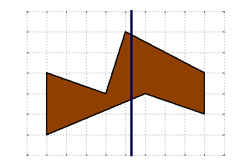

## 문제

Mary the Mathematician has a bakery that she founded some years ago, but after all this time she has become bored with always baking the same rectangular and circular cakes. For her next birthday, she wants to bake an *irregular* cake, which is defined as the area between two "polylines" between x=0 and x=**W**. These polylines will be called the lower boundary and the upper boundary.

Formally, a polyline is defined by a sequence of points (P0, P1, ..., Pn) going from left to right. Consecutive points are connected to form a sequence of line segments, which together make up the polyline.

Today is Mary's birthday and she has baked an irregular cake bounded by two polylines with **L** points and **U** points respectively. After singing "Happy Birthday," she wants to make **G**-1 vertical cuts to split the cake into **G** slices with equal area. She can then share these cake slices with all her guests. However, the irregular cake shape makes this task pretty tricky. Can you help her decide where to make the cuts?

## 입력

The first line of the input gives the number of test cases, **T**. **T** test cases follow. Each test case begins with a line containing four integers: **W** (the cake's width), **L** (the number of points on the lower boundary), **U** (the number of points on the upper boundary) and **G** (the number of guests at the party).

This is followed by **L** lines specifying the lower boundary. The i-th line contains two integers xi and yi, representing the coordinates of the i-th point on the lower boundary. This is followed by **U** more lines specifying the upper boundary. The j-th line here contains two integers xj and yj, representing the coordinates of the j-th point on the upper boundary.

### Limits

* 1 ≤ **T** ≤ 100.
* 1 ≤ **W** ≤ 1000.
* 2 ≤ **L** ≤ 100.
* 2 ≤ **U** ≤ 100.
* All coordinates will be integers between -1000 and 1000, inclusive.
* The x-coordinate of the leftmost point of both boundaries will be 0.
* The x-coordinate of the rightmost point of both boundaries will be **W**.
* Points in the same boundary will be sorted increasingly by x-coordinate.
* Points in the same boundary will have different x-coordinates.
* The lower boundary will always be strictly below the upper boundary for all x between 0 and **W**, inclusive. (In other words, the lower boundary will have a smaller y-coordinate than the upper boundary at every x position.)
* 2 ≤ **G** ≤ 101.

## 출력

For each test case, output **G** lines. The first line should be "Case #x:" where x is the case number (starting from 1). The next **G**-1 lines should contain the x-coordinates at which cuts must be made, ordered from the leftmost cut to the rightmost cut.

Answers with a relative or absolute error of at most 10-6 will be considered correct.
