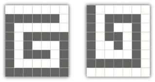

## 문제

Given an rectangular grid of **N** rows and **M** columns, each cell can be labeled black (Yin) or white (Yang). Two cells are *neighbors* if they share a common unit-length edge segment. The grid is *valid* if all the black cells form a path, and all the white cells form a path. A *path* is a set `S` of cells defined as follows:

* The cells form a connected piece. From each cell in `S`, you can reach any other cell in `S` by moving between neighbors within `S`.
* Exactly two cells in `S` have exactly one neighbor in `S` each. These are the "ends" of the path.
* Every other cell in `S` has exactly two neighbors in `S`.

For example, in the picture below, the first grid is valid, while the second grid is not -- although the black cells form a path, the white cells do not. 

Given **N** and **M**, compute the number of valid grids. Note that symmetry doesn't matter -- as long as two valid grids differ in one position they are considered different, even if one can be rotated or flipped to the other.

## 입력

The first line of the input will be a single integer **T**, the number of test cases. **T** lines follow, each of which contains two integers separated by a space: "**N M**", as defined above.

## 출력

For each test case, output a line in the form "Case #**x**: **A**", where **x** is the case number, starting from 1, and **A** is the number of valid grids of the specified size.
