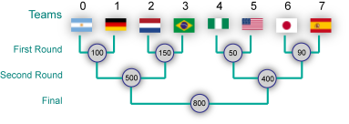

## 문제

After four years, it is the World Cup time again and Varva is on his way to South Africa, just in time to catch the second stage of the tournament.

In the second stage (also called the knockout stage), each match always has a winner; the winning team proceeds to the next round while the losing team is eliminated from the tournament. There are 2P teams competing in this stage, identified with integers from 0 to 2P - 1. The knockout stage consists of P rounds. In each round, each remaining team plays exactly one match. The exact pairs and the order of matches are determined by successively choosing two remaining teams with lowest identifiers and pairing them in a match. After all matches in one round are finished, the next round starts.

    

In order to help him decide which matches to see, Varva has compiled a list of constraints based on how much he likes a particular team. Specifically, for each team `i` he is  **willing to miss at most** `M[i]` matches the team plays in the tournament.

Varva needs to buy a set of tickets that will guarantee that his preferences are satisfied, regardless of how the matches turn out. Other than that, he just wants to spend as little money as possible. Your goal is to find the **minimal amount of money** he needs to spend on the tickets.

Tickets for the matches need to be purchased in advance (before the tournament starts) and the ticket price for each match is known. Note that, in the small input, ticket prices for all matches will be equal, while in the large input, they may be different.

### Example

A sample tournament schedule along with the ticket prices is given in the figure above. Suppose that the constraints are given by the array `M = {1, 2, 3, 2, 1, 0, 1, 3}`, the optimal strategy is as follows: Since we can't miss any games of team 5, we'll need to spend 50, 400, and 800 to buy tickets to all the matches team 5 may play in. Now, the constrains for the other teams are also satisfied by these tickets, except for team 0. The best option to fix this is to buy the ticket for team 0's first round match, spending another 100, bringing the total to 1350.

## 입력

The first line of the input gives the number of test cases, **T**.  **T** test cases follow. Each case starts with a line containing a single integer **P**. The next line contains 2P integers -- the constraints `M[0]`, ..., `M[2P-1]`.

The following block of **P** lines contains the ticket prices for all matches: the first line of the block contains 2P-1 integers -- ticket prices for first round matches, the second line of the block contains 2P-2 integers -- ticket prices for second round matches, etc. The last of the **P** lines contains a single integer -- ticket price for the final match of the World Cup. The prices are listed in the order the matches are played.

### Limits

* 1 ≤ **T** ≤ 50
* 1 ≤ **P** ≤ 10
* Each element of **M** is an integer between 0 and **P**, inclusive.
* All the prices are equal to 1.

## 출력

For each test case, output one line containing "Case #x: y", where x is the case number (starting from 1) and y is the minimal amount of money Varva needs to spend on tickets as described above.
