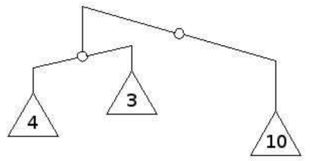

## 문제

The main (potentially tragic) hero of this task is Kile, otherwise known as the joker from the bench of the semiliterate team El Locos, and who is celebrating his birthday today.

His best friend Ivan has decided to gift him a special pharmaceutical scale. The specialty of this scale is that it is recursive, i.e., at the end of each beam, there is either a weight, a new scale, or nothing. Of course, the scale leans to the left if the total mass on its left beam is larger than the total mass on its right beam. Analogously, if the mass is larger on the right beam, then the scale leans to the right. Otherwise, we say that the scale is balanced.

Kile really likes the gift, and, as a true computer scientist, he immediately tries to balance it using new weights for which total mass is the lowest possible ​. New weights should be positive real numbers. We say that a recursive scale is balanced if it is balanced and all its subscales are balanced.

After having successfully balanced the scale, Kile decided to tattoo on his chest the total mass of the weights placed on the scale, in binary notation, without leading zeros. What number is tattooed on Kile’s chest?

## 입력

The first line of input contains the positive integer that represents the total N (1 ≤ N ≤ 106) number of scales Kile’s recursive scale consists of (including itself).

The ith of the following N lines contains two whole numbers that respectively describe the left and the right beam of the scale with index i. A positive number in the scale description denotes the index of the scale located on that beam, whereas a non-positive number denotes that there is a weight on that beam, with its mass corresponding to the absolute value of the number. Root scale which contains all other scales has index 1.

All numbers from the input are in absolute value less than or equal to 109.

## 출력

The first and only line of output must contain the total mass of the weights located on Kile’s scale. This number needs to be in binary notation, without leading zeros.

## 힌트

The example corresponds to the image from the task. Kile will add another weight of mass 1 to the weight of mass 4, and will add another weight of mass 2 to the weight of mass 3. After this, the mass of both beams of the scale with index 2 is equal to 5, so it is balanced, and the mass of both beams of the scale with index 1 is 10, so it is balanced as well. The entire scale is now balanced, and the total mass is 5+5+10=20, i.e., 10100 in binary notation.
