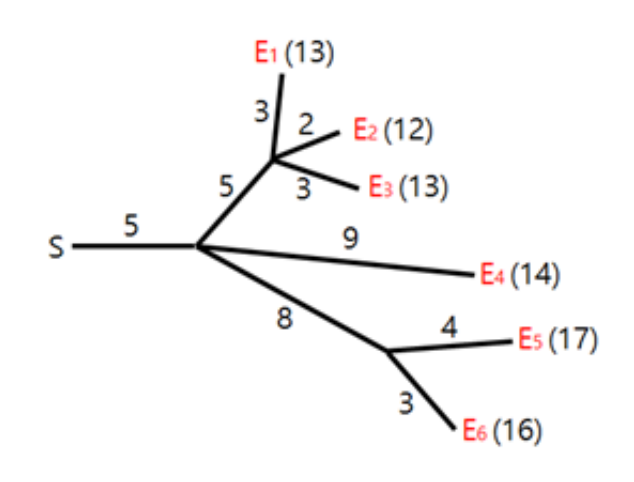
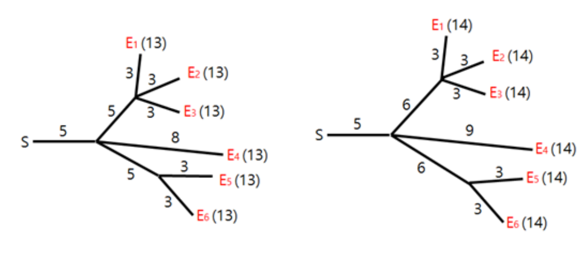

## 문제

불꽃놀이는 축제에서 가장 재미있는 행사 중 하나이다. 불꽃놀이에서 가장 중요한 것은 한 스위치에 도화선으로 연결된 모든 폭약이 계획된 시각에 동시에 폭발해야 한다는 것이다. 폭약들은 위험한 것이라 스위치에서 먼 위치에 설치되어 있고 여러 조각의 도화선들로 스위치에 연결되어 있다. 하나의 스위치에 여러개의 폭약을 연결하기 위해 도화선들은 트리에서 간선들이 연결된 것과 같은 방식으로 연결되어 있다 [Figure 1]. 스위치에서 시작된 불씨는 도화선을 따라서 움직인다. 불씨가 도화선들이 이어진 연결점을 만나면 그 연결점에 이어진 모든 도화선으로 퍼져나간다. 불씨들이 움직이는 속도는 모두 동일하다. [Figure 1]에는 6개의 폭약 {E1, E2, ..., E6}가 연결된 상태와 각 도화선의 길이가 표현되어 있다. 괄호 안의 숫자는 스위치에서 시각 에 불씨가 생겼다고 가정했을 때 각 폭약이 폭발하는 시각이다.



[Figure 1] 연결 상태

불꽃놀이를 준비하는데 참여한 현민이 연결 상태를 하나 구성했다. 불행하게도, 현민이가 만든 연결 상태로는 모든 폭약이 동시에 폭발하지 않을 수 있다. 모든 폭약이 동시에 폭발하도록 하기 위해 일부 도화선들의 길이를 늘이거나 줄이려고 한다. 예를 들어, [Figure 1]의 모든 폭약이 시각 13에 폭발하게 하기 위해 도화선들의 길이를 [Figure 2]의 왼쪽에 있는 것과 같이 조정할 수 있다. 비슷하게, [Figure 1]의 폭약들이 모두 시각 14에 폭발하도록 하기 위해서는 [Figure 2]의 오른쪽에 있는 것과 같이 도화선의 길이를 조정할 수 있다.



[Figure 2] 동시에 폭발하도록 하기 위해 도화선의 길이를 조정한 예

도화선의 길이를 조정하는 비용은 조정 전후의 길이 차이의 절댓값이다. 예를 들어, [Figure 1]의 연결 상태가 [Figure 2]의 왼쪽과 같이 바뀐 경우 비용은 6이다. 만약 [Figure 1]의 연결 상태가 [Figure 2]의 오른쪽과 같이 바뀐다면 비용은 5이다.

도화선의 길이를 0으로 줄이는 것도 가능하다. 이 경우 도화선들의 연결 상태는 그대로 유지된다.

도화선들의 연결 상태를 입력으로 받아 모든 폭약이 동시에 폭발하도록 도화선들의 길이를 조정하는 최소 비용을 출력하는 프로그램을 작성하라.

## 입력

모든 입력 값은 양의 정수이다. 연결점의 수를 N이라고 하고 폭약의 수를 M이라고 하자. (1 ≤ N+M ≤ 300,000) 각 연결점은 1부터 N까지의 자연수로 번호가 붙어 있다. 스위치는 항상 1번 연결점이다. 각 폭약은 N+1부터 N+M까지의 자연수로 번호가 붙어 있다.

입력은 다음과 같은 형태로 주어진다:

```

N M
P2 C2
P3 C3
...
PN CN
PN+1 CN+1
...
PN+M CN+M
```

각 Pi(1 ≤ Pi ≤ i)는 i번 연결점 혹은 폭약이 도화선으로 연결되어 있는 연결점의 번호이다. Ci는 해당 도화선의 길이이다(1 ≤ Ci ≤ 109). 1번 연결점을 제외한 모든 연결점에는 2개 이상의 도화선이 연결되어 있다. 모든 폭약에는 단 하나의 도화선이 연결되어 있다

## 출력

모든 폭약이 동시에 폭발하도록 도화선의 길이를 조정하는 최소 비용을 출력하라.
