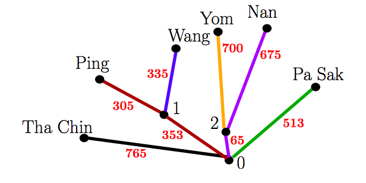

## 문제

The Chao Phraya River System is the main river system of Thailand. Its six longest rivers listed by decreasing length are:

Tha Chin (765 km)  
Nan (740 km)  
Yom (700 km)  
Ping (658 km)  
Pa Sak (513 km)  
Wang (335 km)

A simplified model of this river system is shown in Figure F.1, where the smaller red numbers indicate the lengths of various sections of each river. The point where two or more rivers meet as they flow downstream is called a confluence. Confluences are labeled with the larger black numbers. In this model, each river either ends at a confluence or flows into the sea, which is labeled with the special confluence number 0. When two or more rivers meet at a confluence (other than confluence 0), the resulting merged river takes the name of one of those rivers. For example, the Ping and the Wang meet at confluence 1 with the resulting merged river retaining the name Ping. With this naming, the Ping has length 658 km while the Wang is only 335 km. If instead the merged river had been named Wang, then the length of the Wang would be 688 km while the length of the Ping would be only 305 km.

Figure F.1: The river system in Sample Input 1. Same-colored edges indicate a river.

The raised awareness of this phenomenon causes bitter rivalries among the towns along the rivers. For example, the townspeople along the Wang protest that maybe with a proper naming scheme, their river could actually be the longest, or maybe the second longest (or at least not last!). To end all the guessing, your task is to validate all such claims.

The rank of a river is its position in a list of all rivers ordered by decreasing length, where the best rank is 1 for the longest river. For each river, determine its best possible rank over all naming schemes. At any confluence, the name of a new, larger river in any naming scheme must be one of the names of the smaller rivers which join at that confluence. If two or more rivers have equal lengths in a naming scheme, all the tied rivers are considered to have the best possible ranking. For example, if one river is the longest and all other rivers are equal, those rivers all have rank 2.

## 입력

The first line of input contains two integers n (1 ≤ n ≤ 500 000), which is the number of river sources in the system, and m (0 ≤ m ≤ n − 1), which is the number of confluences with positive labels. These confluences are numbered from 1 to m.

The next n lines describe the rivers. Each of these lines consists of a string, which is the name of the river at the source, and two integers c (0 ≤ c ≤ m) and d (1 ≤ d ≤ 109), where c is the identifier of the nearest confluence downstream, and d is the distance from the source to that confluence in kilometers. River names use only lowercase and uppercase letters a–z, and consist of between 1 and 10 characters, inclusive.

The final m lines describe confluences 1 to m in a similar fashion. The kth of these lines describes the confluence with identifier k and contains two integers: the identifier of the nearest confluence downstream and the distance from confluence k to this confluence in kilometers.

It is guaranteed that each confluence 1 through m appears as “the nearest downstream” at least twice, confluence 0 appears at least once, and all sources are connected to confluence 0.

## 출력

Display one river per line in the same order as in the input. On that line, display the name of the river and its best possible rank.
