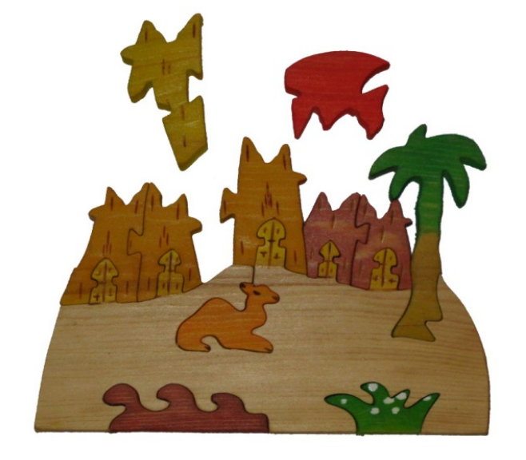
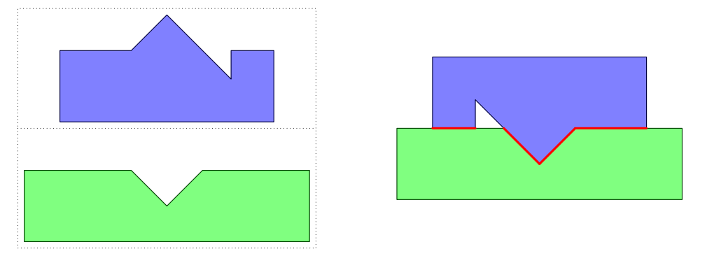

## 문제

During last year’s ACM ICPC World Finals in Marrakesh, one of the judges bought a pretty wooden puzzle depicting a camel and palm trees (see Figure H.1). Unlike traditional jigsaw puzzles, which are usually created by cutting up an existing rectangular picture, all the pieces of this puzzle have been cut and painted separately. As a result, adjacent pieces often do not share common picture elements or colors. Moreover, the resulting picture itself is irregularly shaped. Given these properties, the shape of individual pieces is often the only possible way to tell where each piece should be placed.

Figure H.1: The judge’s wooden puzzle.

The judge has been wondering ever since last year whether it is possible to write a program to solve this puzzle. An important part of such a program is a method to evaluate how well two puzzle pieces “match” each other. The better the match, the more likely it is that those pieces are adjacent in the puzzle.

Pieces are modeled as simple polygons. Your task is to find a placement of two given polygons such that their interiors do not overlap but the polygons touch with their boundaries and the length of the common boundary is maximized. For this placement, polygons can be translated and rotated, but not reflected or resized. Figure H.2 illustrates the optimal placement for Sample Input 1.

## 입력

The input contains the description of two polygons, one after the other. Each polygon description starts with a line containing an integer n (3 ≤ n ≤ 50) denoting the number of vertices of the polygon. This is followed by n lines, each containing two integer coordinates x, y of a polygon vertex (|x|, |y| ≤ 100). The vertices of each polygon are given in clockwise order, and no three consecutive vertices are collinear.

The input data is chosen so that even if the vertices were moved by a distance of up to 10−7, the answer would not increase by more than 10−4.

Figure H.2: Sample Input 1 and its optimal placement.

## 출력

Display the maximum possible length of the common boundary of these polygons when they are optimally placed. Your answer should have an absolute or relative error of less than 10−3.
