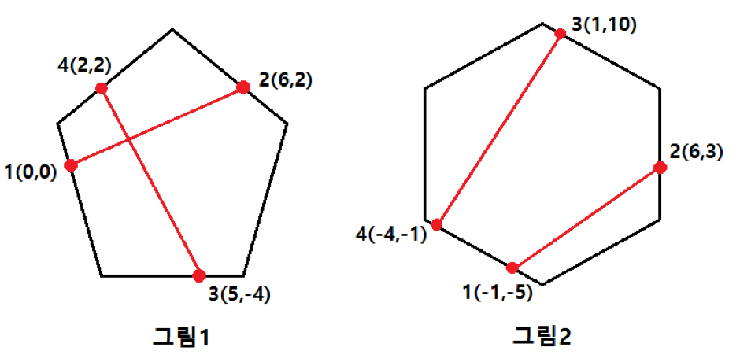

## 문제

도윤이는 친구 3명과 함께 시험이 끝난 기념으로 도윤이의 집에서 놀기로 했다. 갑자기 배가 고파진 도윤이는 근처 맛 집인 PIZZA ALVOLOC에서 피자를 시켜먹기로 했다. 이 곳의 피자는 특이하게도, 보통 피자와 다르게 피자의 모양이 항상 볼록 다각형이다. 도윤이와 친구들은 피자를 네 등분해서 나눠먹기로 했다. 어떻게 나눌지 고민을 하던 중에 도윤이는 피자를 다음과 같이 나누기로 했다.

1. 한 명씩 피자의 가장자리의 한 점을 선택한다. (같은 점을 선택하지 않는다.)
2. 선택한 순서대로 첫 번째 점과 두 번째 점을 이어 선분을 만들고 세 번째 점과 네 번째 점을 이은 선분을 만든다.
3. 만들어진 두 선분을 따라 피자를 자른다.

도윤이와 친구들은 잘라진 피자의 크기에 상관없이 네 조각으로만 나눠지면 먹기로 했다. 만약 네 조각으로 나눠지지 않는다면 도윤이와 친구들은 피자를 두고 싸우게 된다. 예를 들어 그림1의 경우에는 두 선분에 의해 피자가 네 조각으로 나뉘게 된다. 하지만 그림2의 경우에는 두 선분에 의해 피자가 세 조각으로 나뉘게 된다.

도윤이와 친구들이 사이 좋게 피자를 나누어 먹을 수 있는지 알아보는 프로그램을 만들어 보자!

## 입력

입력의 첫 줄에는 도윤이와 친구들이 선택한 점의 좌표 *x*, *y*(-10,000 ≤ *x*, *y* ≤ 10,000)가 순서대로 4개 주어진다. *x*, *y*값은 항상 정수이다.

## 출력

주어진 4개의 점으로 도윤이가 친구들과 사이좋게 피자를 나눠 먹을 수 있으면 1, 그렇지 않으면 0을 출력한다.
