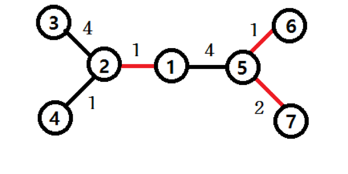

## 문제

인하니카 공화국은 1번~ *N*번까지 *N*개의 섬으로 이루어진 나라이다. 이 나라에서는 섬 간의 왕래가 매우 어려웠지만, 위대한 다리 설계자 ‘진’이 두 섬을 연결하는 다리를 최소한의 개수로 만들어 모든 섬 간의 왕래가 가능하도록 만들었다. 1번섬에서 살고 있는 진은 어느 날 위험한 소문을 듣게 되었다. 1번섬을 제외한 다리가 하나밖에 없는 어느 섬에서 유명한 연쇄 살인마 괴도‘루팡’이 자신의 목숨을 노리고 있다는 소문이었다. 너무 불안한 나머지 진은 몇 개의 다리를 폭파하여, 루팡이 있을 가능성이 있는 모든 섬에서 자신의 섬으로의 모든 경로를 차단하려고 한다. 하지만 각 다리를 폭파하려면 다리의 크기에 따라 다이너마이트의 개수가 다르다. 다이너마이트는 매우 비싸기 때문에 진은 사용하는 다이너마이트의 개수를 최소화하고 싶어 한다. 각 섬을 연결하는 다리를 폭파하기 위한 다이너마이트의 개수가 주어졌을 때, 진을 도와 필요한 최소 다이너마이트의 개수를 구하라.

예를 들어, 위의 그림과 같이 섬과 다리를 폭파하기 위한 다이너마이트의 수가 주어졌을 때, 빨간색 다리를 폭파하면 다이너마이트의 개수를 최소화하면서 루팡으로부터 안전할 수 있다.

## 입력

입력의 첫 줄에는 테스트 케이스의 개수 *T*(1 ≤ *T* ≤ 100)가 주어진다.

각 테스트 케이스의 첫 번째 줄에는 섬의 수 *N*(1 ≤ *N* ≤ 1,000)과 다리의 수 *M*이 주어진다.

다음으로 *M*개의 줄에는 각 다리를 통해 이어진 두 섬의 번호와 다리를 파괴하기 위한 다이너마이트의 수 *D*(1 ≤ *D* ≤ 20)가 주어진다.

## 출력

각 테스트 케이스마다 필요한 최소 다이너마이트의 개수를 출력한다.
