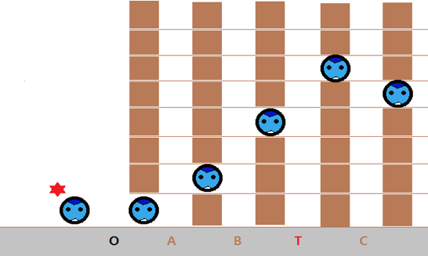

## 문제

평소 Iron man을 좋아하던 규환이는 Iron man Suit에 영감을 받아 Inha Suit를 만들게 되었다. 규환이는 Suit를 입고 모든 나무의 높이가 20m인 숲을 지나서 인하대로 놀러가려고 한다. 하지만 Inha Suit는 Iron man Suit와 다르게 위아래로만 움직일 수 있다는 큰 결점을 갖고 있었고 그마저도 최대 20m까지 올라갈 수 있었다.

이동 기능은 가만히 있는 O기능, 위로 1m 이동하는 A기능, 현재 높이만큼 위로 이동하는 B기능 (만약 현재 높이가 10m 이상이라면 항상 20m로 이동), 아래로 1m 이동하는 C기능과 위 아래 어느 위치로든 순간이동 할 수 있는 T기능을 갖고 있다. (하지만  T기능은 사용자에게 안 좋은 영향을 끼치므로 사용에 제한이 있고, 최소한으로 사용하는 것이 좋다.)

불행하게도 인하대로 이동하던 중 오른쪽 방향으로 강풍이 불어 나무에 부딪혀 목숨을 잃을 수도 있는 상황에 이르렀다. 하지만 다행히도 나무에는 각각 *M*개의 구멍이 있어, 해당 구멍으로 들어가면 나무에 부딪히지 않고 이동할 수 있었고, 각 나무 사이에는 바람이 불어도 이동기능을 1번은 수행할 수 있는 공간이 항상 존재한다.

예를 들면, T 기능 사용 횟수가 최대 2번이고, 나무의 개수가 5개라고 하자. 그리고 1~5번째 나무의 구멍은 각각 1개씩이며, 그 위치가 1, 2, 4, 6, 5라면 그림과 같이 이동했을 때 규환이가 인하대학교에 안전하게 도착한다.

[ 그림 1 ] 문제 예시

처음에는 순차적으로 O, A, B 기능으로 이동하여 세 번째 나무의 구멍이 있는 높이인 4에 도달하게 된다. 이때 네 번째 나무의 유일한 구멍인 높이 6으로 이동하려면, 높이 4에서 

* O기능을 사용했을 때 높이 4 (불가능)
* A기능을 사용했을 때 높이 (4+1) = 5 (불가능)
* B기능을 사용했을 때 높이 (4+4) = 8 (불가능)
* C기능을 사용했을 때 높이 (4-1) = 3 (불가능)  이므로,

위의 4가지 기능으로는 높이 6으로 갈 수 없어 T기능을 사용해야 한다.  T기능을 사용하고 높이 6에 도달하게 되면 다음에는 C기능을 이용하여 높이 5로 이동하면, 규환이를 안전하게 인하대로 이동시키는 것이 가능하다.

하지만 구멍이 여러 개인 경우, T기능을 사용하면 여러 구멍 중 하나를 선택하여 이동할 수 있어 선택이 복잡하다. 이때, 여러분이 규환이가 최선의 선택을 하여 최소한의 T를 사용하고 안전하게 이동할 수 있도록 도와주자.

## 입력

입력의 첫 줄에는 나무의 개수 *N*(1 ≤ *N* ≤ 100)이 주어진다.

입력의 둘째 줄에는 T기능의 제한 횟수 *K*(0 ≤ *K* ≤ 50)가 주어진다.

다음 *N*개의 줄에는 각 나무의 구멍 개수 *M*가 주어지고, *M*개의 구멍의 높이가 주어진다. 이때, Inha Suit가 이동할 수 있는 높이와 나무의 높이는 20이하의 자연수이다.

규환이는 출발할 때 높이가 1인 지점에 있으며, 마찬가지로 첫 나무를 통과할 때까지 이동 기능을 한 번만 사용할 수 있다.

## 출력

규환이 안전하게 마지막 나무까지 통과할 때의 최소 T기능 사용횟수를 출력하고 만약 안전하게 이동할 수 없다면, -1을 출력한다.
