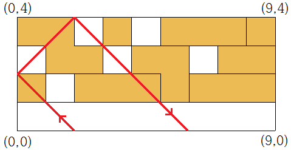

## 문제

격자 위의 블록을 향해 공을 발사해 그 블록들을 깨는 게임은 1976년 아타리가 제작한 Breakout이라는 타이틀 이래로 알카노이드 등 수많은 작품으로 이어져 올 정도로 굉장히 유서가 깊다. 이번 대회의 탱킹을 맡고 있는 현종이와 태현이는 이런 게임 중 하나의 기록을 깨기 위해 경쟁 중이다. 이미 현종이는 자신의 차례를 마쳤고, 태현이의 점수에 따라 누가 벌칙을 받을지가 정해진다. 벌칙은 정말 무시무시하게도 넥슨 아레나에서 진행될 본선 무대의 책상을 전부 혼자 설치하는 것이다.

게임은 비교적 단순하다. 우선 0 ≤ *y* ≤ *M*, 0 ≤ *x* ≤ *N*인 공간이 게임판이다. 가장 밑 줄, 즉 y = 0인 지점에서 공을 왼쪽 위 45도 각도로 쏘아올리면 그대로 직진하다가 블록의 경계에 닿으면 블록을 부수고 벽을 만나면 반사되면서 다시 y = 0인 지점으로 되돌아오면 끝나는 방식이다. 벽은 세 개의 선분 x = 0, x = *N*, y = *M*이다. 즉 최초 발사 위치이자 최후 위치인 y = 0 선분을 제외한 공간을 감싸는 선분들이다. 블록을 부수면 복잡한 일이 일어나지만 지금은 신경쓰지 않아도 된다.

그보다는 블록에 대해 알아보자. 이 게임에서 블록들은 *M*행 *N*열의 격자에 들어맞게 자리잡고 있다. 블록을 하나 제거할 때마다 1점을 득점한다. 조금 특이한 점은, 한 블록은 여러 연결된 격자들로 구성될 수 있다는 것이며, 연결되었다는 것은 격자끼리 상하좌우로 인접하다는 뜻이다. 즉 L자 모양으로 세 개의 격자가 연결되어 하나의 블록을 형성할 수도 있고, 이보다 더 복잡한 모양을 형성하고 있을 수도 있다.

이제 태현이에게 운명의 승부를 가를 마지막 한 번의 공을 발사할 수 있는 기회가 남았다. 이 게임에서 마지막 공에는 특수한 능력이 주어져서, 블록이 존재하지 않는 것처럼 뚫고 바로 파괴하며 지나갈 수 있다. 따라서 블록에 닿았을 때 어떻게 될지는 생각하지 않아도 되며, 벽에 닿아서 튕겨지며 쓸고 지나갈 블록들만 생각하면 된다.

원하는 옆에서 팝콘을 먹고 있다가 태현이가 어디로 발사해야 좋을지 조금 생각해보기로 했다. 게임판의 상태와 발사 위치가 주어질 때 태현이가 없애게 되는 블록의 수를 구해 보자.

## 입력

첫 줄에 게임판의 크기를 나타내는 두 정수 *N*, *M*(1 ≤ *N*, *M* ≤ 100)와 공의 출발 위치를 나타내는 *K*가 주어진다. *K*는 0보다 크고 *N*보다 작으며 0.5의 배수이다. 다음 줄부터는 게임판의 상태를 나타내는 문자들이 2*N*+1개씩 2*M*+1개에 걸쳐 주어진다. 문자는 '`+`'(더하기), '`|`'(파이프), '`-`'(빼기), '`B`', '`O`', '`.`' 중 하나이다.

게임판 입력의 *i*(1 ≤ *i* ≤ 2*M* + 1)번째 줄, *j*(1 ≤ *j* ≤ 2*N* + 1)번째 칸에 대해

* *i*와 *j*모두 홀수: '`+`'가 입력되며 격자의 구분을 위해 입력되는 문자이다.
* *i*와 *j* 모두 짝수: '`B`' 혹은 '`O`'가 주어진다. (*j*/2 - 1, *M* - *i*/2)-(*j*/2, *M* + 1 - *i*/2) 좌표 사이에 '`B`'는 블록이 있음을, '`O`'는 블록이 없음을 의미한다.
* 나머지, '`|`', '`-`', '`.`' 중 하나가 입력된다. 이는 칸을 기준으로 양 옆에 있는 격자 사이의 관계를 의미한다. 만약 양 옆에 있는 두 격자에 모두 블록이 존재하고 그것이 하나의 블록이라면 '`.`'이 주어진다. 그 이외의 경우에 *i*가 홀수일 경우 '`-`', *j*가 홀수일 경우 '`|`'가 주어진다.

## 출력

첫 줄에 마지막 턴에 얻게 되는 점수를 출력하라.

## 힌트

예제 1 설명

