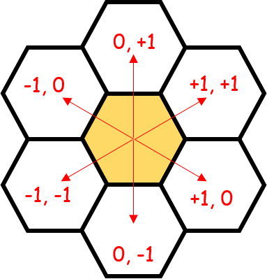
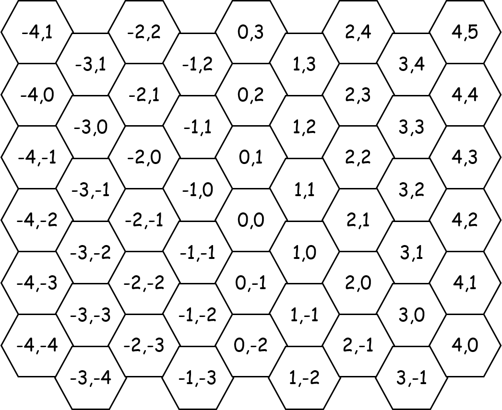
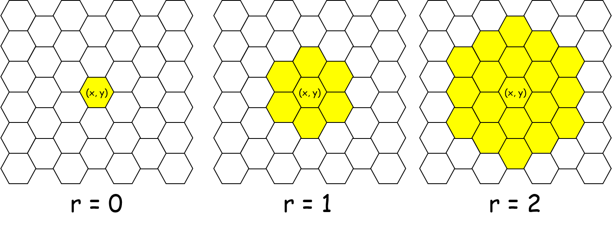
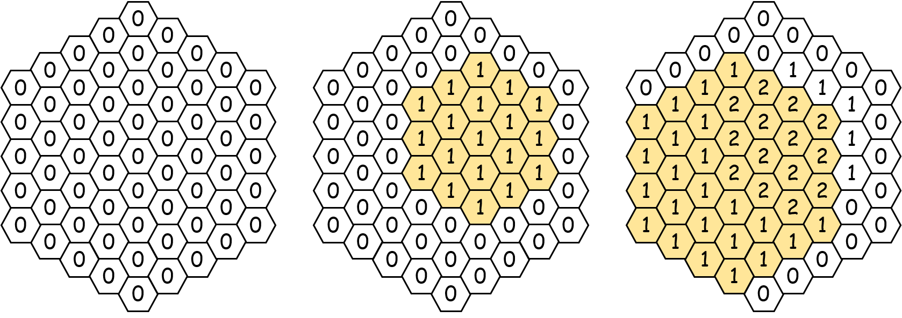

## 문제

2016년 현재, 인간들은 2차원 배열을 활용하여 정사각형 격자로 된 세상을 편하게 관리하고 있었다. 이를 보고 있던 꿀벌 게나디는 벌집을 관리할 때도 배열을 활용하여 관리하면 편리할 것이라고 생각하였다. 하지만 벌집은 정육각형 모양의 칸들로 이루어져 있기에 인간들이 사용하는 배열을 그대로 사용할 수는 없었고, 어쩔 수 없이 벌집에 맞는 배열을 발명할 수밖에 없었다.

게나디가 사는 벌집은 아래 그림과 같이 정육각형 모양의 칸이 서로 붙어 있는 형태이다. 게나디는 우선 벌집의 각 칸을 명확히 나타내기 위해 각 칸에 2차원 좌표를 다음과 같은 방법으로 부여하기로 하였다.

* 자신이 서 있는 칸을 기준인 (0, 0)으로 잡는다.
* 그 외의 칸에는 귀납적으로 좌표를 부여한다. 어떤 칸의 좌표가 (*x*, *y*)라면, 인접한 6개의 칸의 좌표는 아래 [그림 1]과 같이 정의된다.

[그림 2]는 위의 방식으로 벌집의 각 칸에 좌표를 부여한 것이다.

이러한 식으로 좌표를 정하면 벌집의 각 칸의 좌표가 유일하게 결정된다는 것을 성공적으로 증명한 게나디는 '이제 꿀벌들도 문명의 이기를 맛볼 수 있겠구나!' 하고 좋아하며 이 발상을 모든 꿀벌에게 알리려고 했으나, 문득 그 전에 최소한의 검증을 해 보는 게 좋지 않을까 하는 생각이 들어, 일단 인간들이 사용하는 배열로는 간단하게 풀 수 있다는 문제를 벌집 버전으로 바꾸어 해결해보기로 하였다. 인터넷의 도움을 받아 게나디는 아래 문제를 해결하기로 하였다:

---

게나디는 벌집의 모든 칸에 0을 적어 놓았다. 이때 다음과 같은 연산을 지원하는 자료구조를 구현하라.

1. 더하기: (*x*, *y*)와의 거리가 *r* 이하인 모든 칸에 1을 더하라. 서로 다른 두 칸 A, B 사이의 거리는 벌집에서 인접한 칸으로만 이동하여 A에서 출발하여 B에 도착하기 위해 이동해야 하는 최소 횟수를 의미한다. 같은 칸 사이의 거리는 특별히 0으로 정의한다.

2. 찾아보기: (*x*, *y*)에 어떤 값이 적혀 있는지 출력하라.

---

게나디를 위해 문제를 해결해주는 프로그램을 작성하자.

## 입력

첫 번째 줄에는 게나디가 사는 벌집의 크기 *N* (1 ≤ *N* ≤ 2,000)과 연산의 수 *Q* (1 ≤ *Q* ≤ 200,000)가 공백을 사이로 두고 주어진다. 게나디는 (0, 0)과의 거리가 *N* 이하인 칸들에만 관심을 가진다고 하자.

다음 *Q*개 줄에는 연산의 정보가 주어진다.

* 1번 종류의 연산을 한다면, "`1 x y r`"과 같은 형식으로 입력이 주어진다. (*x*, *y*)와의 거리가 *r* 이하인 모든 칸들은 (0, 0)과의 거리가 *N* 이하임이 보장된다.
* 2번 종류의 연산을 한다면, "`2 x y`"과 같은 형식으로 입력이 주어진다. (*x*, *y*)과 (0, 0)과의 거리는 *N* 이하임이 보장된다.

## 출력

2번 종류의 연산이 주어질 때마다 해당 칸에 적힌 수를 한 줄에 하나씩 출력한다. 적어도 하나의 2번 연산이 주어짐이 보장된다.

## 힌트

