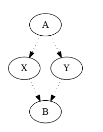
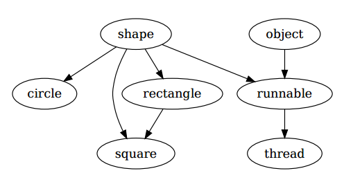
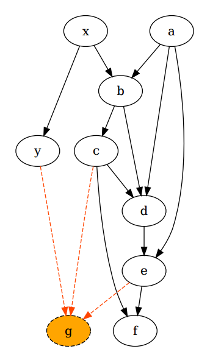

## 문제

We are observing class declarations in an object-oriented programming language similar to C++. Each class declaration is of the form “*K* : *P1* *P2* . . . *Pk* ;” where *K* is the name of the new class being declared, and *P1*, *P2*, . . . , *Pk* the names of classes being inherited by class *K*. For example, “`shape : ;`” is a declaration of class “`shape`” that does not inherit any other class, whereas “`square : shape rectangle ;`” is a declaration of class “`square`” that inherits classes “`shape`” and “`rectangle`”.

If class *K1* inherits class *K2*, class *K2* inherits class *K3*, and so on, up to class *Km−1* that inherits class *Km*, then we say that all classes *K1*, *K2*, . . . , *Km−1* are derived from class *Km*. The rules of the programming language forbid circular definitions, so it is not allowed to have a class derived from itself. In other words, the class hierarchy forms a directed acyclic graph. Additionally, it is not allowed for a so-called diamond to appear in the class hierarchy. A diamond consists of four different classes *A*, *B*, *X*, *Y* such that it holds:

* Classes *X* and *Y* are derived from *A*.
* Class *B* is derived from both *X* and *Y*.
* Neither is class *X* derived from *Y*, nor is class *Y* derived from *X*.

Figure 1: A diamond

Figure 2: The hierarchy after processing all declarations from the first sample test

You are given a series of class declarations to be processed sequentially, and determine for each one whether it is correctly declared. The correctly declared classes are added to the hierarchy, while the incorrect ones are discarded. Declaration “*K* : *P1* *P2* . . . *Pk* ;” is correctly declared if the following holds:

1. Class *K* hasn’t been declared yet.
2. All classes *P1*, *P2*, . . . , *Pk* have been previously declared. Notice that this condition ensures that a class can never be derived from itself, or that cycles cannot exist in the class hierarchy.
3. By adding class *K* that inherits *P1*, *P2*, . . . , *Pk* the class hierarchy remains in order, that is, not a single diamond is formed.

Write a programme that will process the declarations respectively as described above and determine the correctness of each one of them.

## 입력

The first line of input contains the integer *n* – the number of declarations. Each of the following *n* lines contains a single declaration in the form of “*K* : *P1* *P2* . . . *Pk* ;” where *P1*, *P2*, . . . , *Pk* is a series of zero, one or more classes that class *K* inherits. All class names in a single declaration *K*, *P1*, *P2*, . . . , *Pk* are mutually different. Each class name is a string of at most 10 lower case letters of the English alphabet. All the elements of a declaration (the class names and characters “`:`” and “`;`”) are separated by exactly one space. In each specific declaration, for the number of classes *k* it holds 0 ≤ *k* ≤ 1 000.

## 출력

You must output *n* lines. The *i*th line must contain “`ok`” if the *i*th declaration is correct, and “`greska`” if it isn’t.

## 힌트

Clarification of the first example:

* The fourth declaration is incorrect because class “circle” has already been defined in the third row.
* The sixth declaration is incorrect because class “object” hasn’t been defined yet.
* The eighth declaration is correct because class “object” has now been declared, and the sixth declaration was discarded, so class “runnable” hasn’t been defined yet.
* The tenth declaration is incorrect because otherwise the following diamond forms: “shape”, “applet”, “square”, “runnable”.

Clarification of the second example:

* The tenth declaration is incorrect because otherwise the following diamond forms: “x”, “g”, “y”, “d” (and many other).
