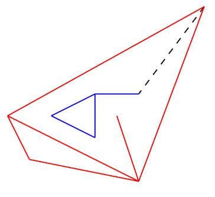

## 문제

In Byteland, there are two highway networks operated by two companies: Red and Blue. Both networks consist of junction points and straight lines connecting pairs of junction points, called segments. Any two segments are non-crossing, meaning that they can only touch at junction points. Both networks are connected, that is any two junction points are connected through a series of consecutive segments. Moreover, the two systems are disjoint, i.e., no junction point appears in both networks. The two companies have now decided to fuse into a single one, and they want to connect their networks by building a straight line segment between two junction points, one in each network. The new segment cannot cross any existing segment.

Write a program that computes a suitable connecting segment.

## 입력

The input contains the description of the Red, followed by the description of the Blue network. The first line of the description contains two integers N (2 ≤ N ≤ 200000) and M (1 ≤ M ≤ 700000). N is the number of the junction points and M is the number of the segments. Each of the following N lines contains two integers x and y (−1000000 ≤ x, y ≤ 1000000), which are the coordinates of a junction point. Each of the following M lines contains two integers p and q (1 ≤ p ≠ q ≤ N), the endpoints of a segment. Junction points are identified by the numbers 1, . . . , N in the order of their appearance in the input.

## 출력

The first and only line of the output contains two integers u and v, the endpoints of a connecting segment. That is, u is junction point of the Red, v is a junction point of the Blue network and the line segment with endpoints u and v crosses no segment of any of the networks. If there are multiple solutions, your program should output only one; it does not matter which one.

## 힌트

