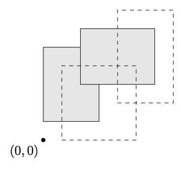

## 문제

Mirek is a devoted fan of his favorite music band. He attends every concert and collects their posters. Each time, when he gets a new poster, he hangs it on the wall, above his bed. After many years of collecting posters, almost the whole wall has been covered with them and now Mirek cannot find space for the new ones. He just got some new posters to hang and he needs your help to find the best place for them on the wall. For each poster and its placement, Mirek would like to know how much this poster would cover other posters.

You are given the coordinates of the posters which already hang on the wall and the coordinates of the posters which do not hang yet, but Mirek considers hanging them. For each new poster, find the area of the parts of hanging posters which would be covered directly by this poster.

The posters on the wall may overlap, and if their intersection is covered, you shouldn’t count its area twice.

## 입력

On the first line of input there is one integer N (1 ≤ N ≤ 100 000) – the number of posters which hang on the wall. In the next N lines, there are descriptions of those posters. In N + 2 line there is one integer M (1 ≤ M ≤ 100 000) – the number of new posters which Mirek would like to hang on the wall. In the next M lines, there are descriptions of those posters.

Each poster is a rectangle with edges parallel to axis. It is described by four integers x1, y1, x2, y2 (0 ≤ x1 < x2 ≤ 109, 0 ≤ y1 < y2 ≤ 109), denoting the coordinates of the bottom left corner and the top right corner.

## 출력

For each new poster output one line containing an integer – the answer for the Mirek’s problem. The answers should be printed in the same order as the posters were given in the input.

## 힌트

Mirek’s wall is presented on the picture below. Dashed rectangles are the new posters, and filled rectangles are the posters which have been already hanged.

