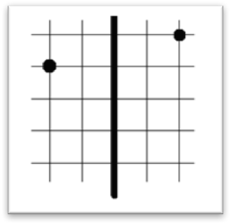

## 문제

대부분의 KAISTIAN들은 방청소를 하지 않아 기숙사에 물건들이 매우 어지럽게 널려있다. 어느 날, 철수는 방이 너무 더러워 오랜만에 물건들을 깔끔하게 정리정돈하기로 결정하였다. 깔끔하다는 것은 방을 정확히 절반으로 나누는 직선을 L이라고 할 때 임의의 물건의 위치에서 L에 선대칭 시킨 위치에 어떤 물건이 있는 것이다. 이때, 현재 위치에 있는 물건의 개수와 선대칭 시킨 위치에 있는 물건의 개수가 같아야 한다. 물건들을 옮기는 일은 매우 힘든 일이다. 따라 철수는 물건들을 하나씩 옮기는데 그 거리들의 합을 최소화 하려고 한다. (철수가 물건을 들지 않고 이동하는 거리는 무시하자)

이 문제에선 L을 y축으로 정의하며, 물건들의 좌표가 2차원상의 좌표로 주어진다고 하자. 철수를 도와서 모든 물건들을 깔끔하게 정리정돈 했을 때, 물건들이 이동하는 거리의 합의 최솟값을 구하자. (거리는 유클리드 거리를 사용한다.) \(D = \sqrt{(x\_1-x\_2)^2 + (y\_1-y\_2)^2}\)

예를 들어, 다음과 같이 물건이 주어진다면 오른쪽의 물건을 1칸 아래로 내리면 정리정돈이 되고, 이때 물건의 이동거리는 1이다.

## 입력

입력의 첫 줄에는 정수 N(1 ≤ N ≤ 100)이 주어진다. 그 다음 N줄에 각 물건들의 위치가 차례대로 주어진다. 각 좌표는 −1,000이상 1,000이하의 정수이다. 물건들이 겹쳐있는 경우는 없다.

## 출력

모든 물건들을 깔끔하게 정리정돈 했을 때, 물건들이 이동하는 거리의 합의 최솟값을 소수점 셋째자리까지 반올림해 출력한다.
