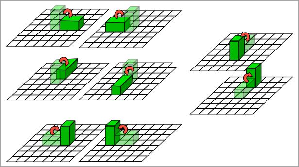

## 문제

블록 퍼즐은 단위 정사각형으로 나누어져 있는 정사각형 그리드에서 즐기는 게임이다. 칸 중의 일부는 시작칸으로 표시되어 있고, 한 칸은 도착칸으로 표시되어 있다.

게임은 시작칸 중의 하나에 1×1×2 블록을 놓으면서 시작한다. 이때, 1×1면이 칸과 닿아야 한다. 게임의 목표는 블록을 적절히 움직여서 도착칸에 서있게 만드는 것이다. 즉, 1×1면이 도착칸에 닿아있어야 한다.

게임은 블록을 굴리면서 진행한다. 1×1면이 그리드에 닿아있는 경우에는 네 방향 모든 방향으로 블록을 굴릴 수 있다. 하지만, 2×1 면이 그리드에 닿아있는 경우에는 1×1면이 그리드에 닿게만 굴릴 수 있다. 즉, 항상 변의 길이가 1인 곳을 기준으로 굴려야 한다.

아래 그림은 이동시킬 수 있는 방법을 모두 나타낸 것이고, 이전 상태가 반투명으로 그려져 있다.

이 게임이 어려워지는 이유는 일부 칸에 구멍이 뚫려있기 때문이다. 블록의 바닥면이 모두 구멍 위에 있다면, 블록은 구멍으로 떨어지고 게임에서 패배하게 된다. 만약, 블록의 바닥면이 2×1이고, 구멍이 두 칸 중 하나에만 있다면 블록은 떨어지지 않는다. 블록은 게임판의 경계에 걸칠 수도 있다. 즉, 바닥면이 2x1인 경우에 한 칸이 게임판 위에 있고, 한 칸이 게임판 밖에 있는 경우는 가능하다.

홍준이는 이 게임을 너무 많이 했기 때문에 지루해졌다. 따라서, 이 게임을 풀 수 없게 하기 위해서 구멍을 만들어보려고 한다. 홍준이는 시작칸과 도착칸이 아닌 칸을 구멍으로 만들 수 있다.

게임판의 상태가 주어졌을 때, 게임을 풀 수 없게 만들기 위해 홍준이가 바꿔야 하는 칸의 개수의 최솟값을 구하는 프로그램을 작성하시오.

## 입력

첫째 줄에 게임판의 크기 N이 주어진다. 둘째 줄부터 N개의 줄에는 게임판의 상태가 주어진다. (3 ≤ N ≤ 50)

'.'은 칸, 'H'는 구멍, 'b'는 시작점, '\$'는 도착점을 나타낸다.

게임판에 있는 '\$'의 개수는 항상 1개이며, 'b'는 1개 이상이다.

## 출력

첫째 줄에 게임을 풀 수 없게 하기 위해서 구멍으로 바꿔야 하는 칸의 최소 개수를 출력한다. 만약, 게임을 풀 수 없게 할 수 없다면 -1을 출력한다.
