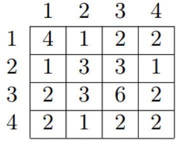

## 문제

길이가 N인 수열 A = {a1 ~ an}이 있을 때, A의 GCD 테이블 G는 아래 공식에 의해 정의된다.

gij = gcd(ai, aj)

gcd(x, y)란 두 수 x, y의 최대 공약수를 뜻한다. 예를 들어 길이가 4인 수열 A = {4, 3, 6, 2}의 GCD 테이블은 아래와 같다.

GCD 테이블 G를 구성하는 모든 gij가 주어질 때, 원본 수열 a를 구하여라.

## 입력

첫 줄에 수열 A의 길이 N(1 ≤ N ≤ 500)이 주어진다. 두 번째 줄에는 A의 GCD 테이블의 N\*N개의 값이 임의의 순서로 공백을 사이에 두고 주어진다. 모든 GCD 테이블의 숫자는 양의 정수이며, 1,000,000,000을 넘지 않는다. 원본 수열 A를 구할 수 없는 경우는 주어지지 않는다.

## 출력

한 줄에 공백으로 구분된 N개의 양의 정수를 출력한다. 만약 가능한 답이 여러개라면, 그 중 아무거나 출력한다.
