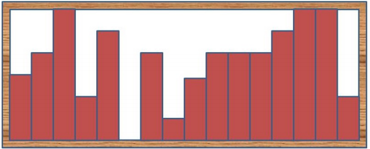
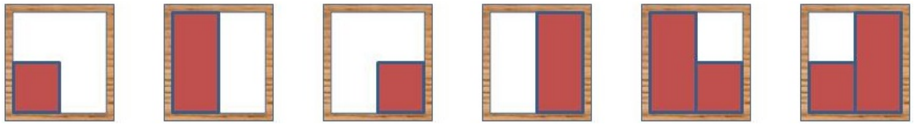
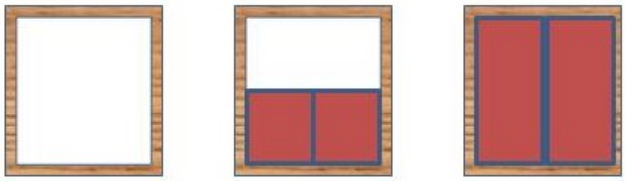

## 문제

An artist begins with a roll of ribbon, one inch wide. She clips it into pieces of various integral lengths, then aligns them with the bottom of a frame, rising vertically in columns, to form a mountain scene. A mountain scene must be uneven; if all columns are the same height, it’s a plain scene, not a mountain scene! It is possible that she may not use all of the ribbon.

If our artist has 4 inches of ribbon and a 2 × 2 inch frame, she could form these scenes:

She would not form these scenes, because they’re plains, not mountains!

Given the length of the ribbon and the width and height of the frame, all in inches, how many different mountain scenes can she create? Two scenes are different if the regions covered by ribbon are different. There’s no point in putting more than one piece of ribbon in any column.

## 입력

Each input will consist of a single test case. Note that your program may be run multiple times on different inputs. The input will consist of a single line with three space-separated integers n, w and h, where n (0 ≤ n ≤ 10,000) is the length of the ribbon in inches, w (1 ≤ w ≤ 100) is the width and h (1 ≤ h ≤ 100) is the height of the frame, both in inches.

## 출력

Output a single integer, indicating the total number of mountain scenes our artist could possibly make, modulo 109 + 7.
