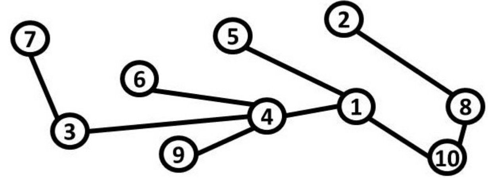

## 문제

In Tree City, there are n tourist attractions uniquely labeled 1 to n. The attractions are connected by a set of n − 1 bidirectional roads in such a way that a tourist can get from any attraction to any other using some path of roads.

You are a member of the Tree City planning committee. After much research into tourism, your committee has discovered a very interesting fact about tourists: they LOVE number theory! A tourist who visits an attraction with label x will then visit another attraction with label y if y > x and y is a multiple of x. Moreover, if the two attractions are not directly connected by a road the tourist will necessarily visit all of the attractions on the path connecting x and y, even if they aren’t multiples of x. The number of attractions visited includes x and y themselves. Call this the length of a path.

Consider this city map:



Here are all the paths that tourists might take, with the lengths for each:

```

1 → 2 = 4, 1 → 3 = 3, 1 → 4 = 2, 1 → 5 = 2, 1 → 6 = 3, 1 → 7 = 4,
1 → 8 = 3, 1 → 9 = 3, 1 → 10 = 2, 2 → 4 = 5, 2 → 6 = 6, 2 → 8 = 2,
2 → 10 = 3, 3 → 6 = 3, 3 → 9 = 3, 4 → 8 = 4, 5 → 10 = 3
```

To take advantage of this phenomenon of tourist behavior, the committee would like to determine the number of attractions on paths from an attraction x to an attraction y such that y > x and y is a multiple of x. You are to compute the sum of the lengths of all such paths. For the example above, this is: 4 + 3 + 2 + 2 + 3 + 4 + 3 + 3 + 2 + 5 + 6 + 2 + 3 + 3 + 3 + 4 + 3 = 55.

## 입력

Each input will consist of a single test case. Note that your program may be run multiple times on different inputs. The first line of input will consist of an integer n (2 ≤ n ≤ 200,000) indicating the number of attractions. Each of the following n−1 lines will consist of a pair of space-separated integers i and j (1 ≤ i < j ≤ n), denoting that attraction i and attraction j are directly connected by a road. It is guaranteed that the set of attractions is connected.

## 출력

Output a single integer, which is the sum of the lengths of all paths between two attractions x and y such that y > x and y is a multiple of x.
