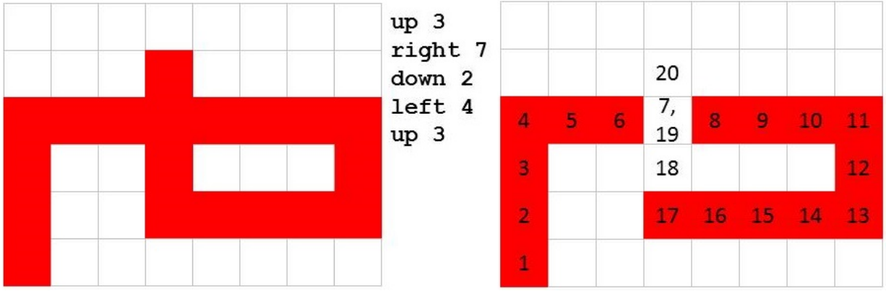

## 문제

Mr. Turtle loves drawing on his whiteboard at home. One day when he was drawing, his marker dried out! Mr. Turtle then noticed that the marker behaved like an eraser for the remainder of his drawing.

Mr. Turtle has a picture in his head of how he wants his final drawing to appear. He plans out his entire drawing ahead of time, step by step. Mr. Turtle’s plan is a sequence of commands: up, down, left or right, with a distance. He starts drawing in the bottom left corner of his whiteboard. Consider the 6 × 8 whiteboard and sequence of commands in the first diagram. If the marker runs dry at timestep 17, the board will look like the second diagram (the numbers indicate the timestep when the marker is at each cell). Note that it will make a mark at timestep 17, but not at timestep 18.

Mr. Turtle wants to know the earliest and latest time his marker can dry out, and he’ll still obtain the drawing in his head. Can you help him? Note that timestep 0 is the moment before the marker touches the board. It is valid for a marker to dry out at timestep 0.

## 입력

Each input will consist of a single test case. Note that your program may be run multiple times on different inputs. The input will start with a line with 3 space-separated integers h, w and n (1 ≤ h, w, n ≤ 1,000,000, w · h ≤ 1,000,000) where h and w are the height and width of the whiteboard respectively, and n is the number of commands in Mr. Turtle’s plan.

The next h lines will each consist of exactly w characters, with each character being either ‘#’ or ‘.’ . This is the pattern in Mr. Turtle’s head, where ’#’ is a marked cell, and ‘.’ is a blank cell.

The next n lines will each consist of a command, of the form “direction distance”, with a single space between the direction and the distance and no other spaces on the line. The direction will be exactly one of the set {up, down, left, right}, guaranteed to be all lower case. The distance will be between 1 and 1,000,000 inclusive. The commands must be executed in order. It is guaranteed that no command will take the marker off of the whiteboard.

## 출력

Output two integers, first the minimum, then the maximum time that can pass before the marker dries out, and Mr. Turtle can still end up with the target drawing. Neither number should be larger than the last timestep that the marker is on the board, so if the marker can run to the end and still draw the target drawing, use the last timestep that the marker is on the board. If it’s not possible to end up with the target drawing, output -1 -1.
