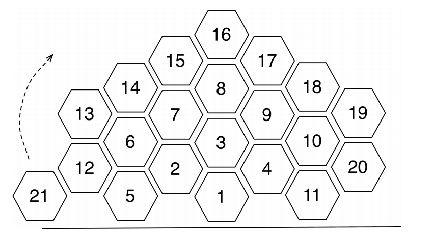

## 문제

There is an infinite beehive like the one given in the figure. We consider two cells to be adjacent if and only if they share a side. A path of length k from cell c0 to cell ck is a sequence of cells c0, c1, . . . , ck such that ci and ci+1 are adjacent for all 0 ≤ i < k. The distance between cells i and j is the length of the shortest path from cell i to cell j.

The cells of the beehive are indexed using positive integers as shown. The cells with larger distance from cell 1 are given larger indices. The indices of cells with the same distance from cell 1 increases from left to right. Each positive integer is the index of exactly one cell.

We want to know the distance of two cells whose indices are given.

## 입력

There are multiple test cases in the input. Each test case is a single line containing two space-separated integers i and j as the indices of two cells (1 ≤ i, j ≤ 104). The input terminates with a line containing 0 0 which should not be processed as a test case.

## 출력

For each test case, output a single line containing the distacne of the given cells.
