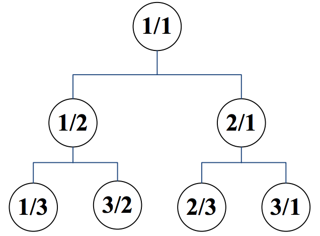

## 문제

We inductively label the nodes of a rooted binary tree with an infinite number of nodes as follows:

* The root is labeled by 1/1,
* If the label of a node is p/q, then
  + The label of its left child is p/(p+q), and
  + The label of its right child is (p+q)/q.

By having this tree in our hand, we define a rational sequence a1, a2, a3, … by a breadth first traversal of the tree in such a way that nodes in the same level are visited from left to right. Therefore, we have a1 = 1/1, a2 = 1/2, a3 = 2/1, a4 = 1/3, a5 = 3/2, …

You are to write a program that gets values p and q and computes an integer n for which an = p/q.

## 입력

The first line of the input includes the number of test cases, 1 ≤ t ≤ 1000. Each test case consists of one line. This line contains p, followed by / and then q without any space between them.

## 출력

For each test case, output in one line an integer n for which an = p/q. It is guaranteed that in all test cases n fits in a 32-bit integer.
