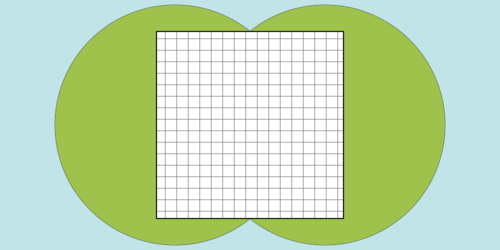

## 문제

Circles Island is known for its mysterious shape: it is a completely flat island with its shape being a union of circles whose centers are on the x-axis and their inside regions.

The King of Circles Island plans to build a large square on Circles Island in order to celebrate the fiftieth anniversary of his accession. The King wants to make the square as large as possible. The whole area of the square must be on the surface of Circles Island, but any area of Circles Island can be used for the square. He also requires that the shape of the square is square (of course!) and at least one side of the square is parallel to the x-axis.

You, a minister of Circles Island, are now ordered to build the square. First, the King wants to know how large the square can be. You are given the positions and radii of the circles that constitute Circles Island. Answer the side length of the largest possible square.

N circles are given in an ascending order of their centers' x-coordinates. You can assume that for all i (1 ≤ i ≤ N−1), the i-th and (i+1)-st circles overlap each other. You can also assume that no circles are completely overlapped by other circles.



fig.1 : Shape of Circles Island and one of the largest possible squares for test case #1 of sample input

## 입력

The input consists of multiple datasets. The number of datasets does not exceed 30. Each dataset is formatted as follows.

```

N
X1 R1
:
:
XN RN
```

The first line of a dataset contains a single integer N (1 ≤ N ≤ 50,000), the number of circles that constitute Circles Island. Each of the following N lines describes a circle. The (i+1)-st line contains two integers Xi (−100,000 ≤ Xi≤ 100,000) and Ri (1 ≤ Ri≤ 100,000). Xi denotes the x-coordinate of the center of the i-th circle and Ri denotes the radius of the i-th circle. The y-coordinate of every circle is 0, that is, the center of the i-th circle is at (Xi, 0).

You can assume the followings.

* For all i (1 ≤ i ≤ N−1), Xi is strictly less than Xi+1.
* For all i (1 ≤ i ≤ N−1), the i-th circle and the (i+1)-st circle have at least one common point (Xi+1−Xi≤ Ri+Ri+1).
* Every circle has at least one point that is not inside or on the boundary of any other circles.

The end of the input is indicated by a line containing a zero.

## 출력

For each dataset, output a line containing the side length of the square with the largest area. The output must have an absolute or relative error at most 10−4.
