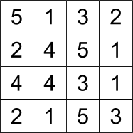
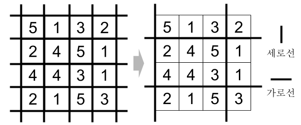

## 문제

1×1 크기의 정사각형 격자가 정사각형 형태로 배열된 N행 N열의 격자판이 있고, 격자판의 각 격자에는 1 이상 5 이하의 자연수가 하나씩 적혀 있다. 당신은 이 격자판을 활용하여 도박장을 운영해보려고 한다.

*N* = 4일 때 가능한 격자판의 예

당신이 생각해낸 도박 방법은 아래와 같다. 우선 아래 그림과 같이, 격자판의 각 변을 연장하여 세로선 *N* + 1개와 가로선 *N* + 1개를 만든다. 그 후, 고객에게 서로 다른 가로선 2개와 세로선 2개를 택하도록 한다. 고객은 가로선과 세로선이 어디에 그어져 있는지 모르는 상태로 선택하기 때문에, 가능한 *N*(*N*+1)/2 × *N*(*N*+1)/2 가지의 경우 중 하나를 무작위로 선택할 것이다.

격자판에 5개의 세로선과 5개의 가로선이 있고, 고객은 이 중 세로선 두 개와 가로선 두 개를 선택한다.

그 후, 당신은 고객이 선택한 선들로 둘러싸인 직사각형을 가지고 점수를 매겨, 고객에게 그 점수에 해당하는 돈을 줄 것이다. 점수를 매기는 방법은 간단하다. 먼저 직사각형 내에 있는 1, 2, 3, 4, 5의 개수를 세어, 각각 *c1*, *c2*, *c3*, *c4*, *c5*라고 둔다. 그 후, 고객이 받는 점수 *S*를 아래 공식에 대입하여 계산한다.

*S* = 1 × *c1*2 + 2 × *c2*2 + 3 × *c3*2 + 4 × *c4*2 + 5 × *c5*2

개수에 제곱을 붙임으로써, 고객의 선택으로 만들어진 직사각형이 커지면 커질수록 점수 *S*가 더 많이 늘어나는 효과가 생기고, 이는 도박성을 강화하여 더 많은 고객을 유치하는 데에 도움을 줄 것이다. 이제 당신에게 남은 것은 판돈을 정하는 것인데, 이를 위해 고객이 받는 점수 *S*의 기댓값을 구해야 한다.

격자판이 주어질 때, *S*의 기댓값을 구하는 프로그램을 작성하라.

## 입력

첫 번째 줄에는 격자판의 크기를 나타내는 자연수 *N* (1 ≤ *N* ≤ 1 000)이 주어진다.

다음 *N*개의 줄에는 각각 1 이상 5 이하의 자연수 *N*개가 공백을 사이로 두고 주어진다. *i*번째 줄에 주어지는 *j*번째 수(1 ≤ *i* ≤ *N*, 1 ≤ *j* ≤ *N*)는 격자판의 위에서부터 *i*번째 행, 왼쪽에서부터 *j*번째 열에 적혀 있는 수를 의미한다.

## 출력

첫 번째 줄에 *S*의 기댓값을 출력한다. 출제진의 답과 절대 오차 또는 상대 오차가 10−4 이하일 시 정답으로 인정한다.
