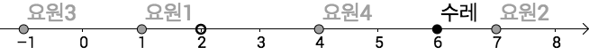

## 문제

특수부대 ‘CH’는 악당들로부터 전 세계를 지키기 위해 오늘도 악의 무리와 끝없이 분투하고 있다. ‘CH’ 는 각계 여러 방면에서 두각을 드러내고 있으나 개중에서도 가장 저명한 분야는 역시 물자 보호인데, 이는 악당들로부터 물자가 들어있는 짐 수레를 보호하여 안전하게 목적지까지 배송하는 일이다.

물자 보호는 수직선 위에서 이루어진다. 짐 수레와 각각의 ‘CH’ 요원은 수직선 위의 한 점으로 나타낼 수 있다. ‘CH’는 원활한 임무 수행을 위해 표준을 지키므로 좌표의 단위는 미터(m)이다. 수레는 현재 좌표 *s* 위에 있으며, 목표 좌표는 *e*이다. 요원들의 임무는 가능한 한 빨리 수레를 목표 지점으로 옮기는 것이다.

수레는 6에서 출발하고, 2에 도착하는 것이 목표이다. 네 명의 요원이 1, 7, -1, 4 위에 서 있다.

어떤 순간에 수레가 움직이는 속력은, 그 순간 수레에 타고 있는(즉 수레와 같은 위치에 있는) 요원의 수를 *p*라 할 때, *p* m/s이다. 수레는 항상 도착 지점을 향해서만 움직인다. 또한 어떤 요원이 짐 수레에 한 번 탑승하면, 자신이 원래 움직이던 속도와는 관계없이, 수레와 함께 목표 지점까지 움직이게 된다. 수레가 목표 지점에 도달하면 더 이상 움직이지 않는다.

한편 요원들은 짐 수레를 배송하던 중 적에게 총격을 받을 수 있으며, 총격을 받으면 체력이 감소하게 된다. 어떤 요원의 체력이 감소하다가 0이 되면 사망하게 되며, 사망한 시점으로부터 10초 뒤 자신의 초기 위치에서 가득 찬 체력과 함께 다시 살아나 임무를 속행한다.

모든 요원들의 총격 사실은 기록되고 있다. 각 요원은 자신의 고유한 속력을 유지하며 항상 수레를 향해 움직인다.

‘CH’ 팀에는 깨달음을 얻은 오라클 요원이 있었기 때문에 모든 요원들은 미래에 맞을 총격에 대하여 모두 공유하여 알고 있고, 따라서 이 미래 예측을 바탕으로 배송을 가장 빠르게 하기 위한 최선의 움직임을 선택할 수 있었다.

당신은 ‘CH’의 기록관으로써 이러한 기록들을 모두 조회할 수 있으나, 이러한 기록들이 내가 원하는 시간에 짐 수레가 어느 위치에 있었는지 알려주지는 못했다.

짐 수레의 배송 상황이 궁금했던 당신은 위 기록들을 토대로 내가 궁금한 시간에 짐 수레가 어디에 있었는지 복원해보기로 하였다.

## 입력

첫 번째 줄에는 짐 수레가 처음 위치한 점의 좌표 *s*(0 ≤ *s* ≤ 1 000)와 목표 지점의 좌표 *e*(0 ≤ *e* ≤ 1 000) 가 공백을 사이로 두고 차례대로 주어진다.

두 번째 줄에는 운반을 맡은 ‘CH’ 요원의 수 *m* (1 ≤ *m* ≤ 10)이 주어진다.

다음 *m*개의 줄에는 각 요원들의 정보가 주어진다. 이 중 *i*번째 줄(1 ≤ *i* ≤ *m*)에는 요원의 초기 위치(m) *xi* (0 ≤ *xi* ≤ 1 000), 초기 체력 *hi* (150 ≤ *hi* ≤ 600), 이동 속력(m/s) *si* (1 ≤ *si* ≤ 1 000)이 공백을 사이로 두고 차례로 주어진다.

그 다음 줄에는 발생한 모든 총격의 수 *l* (1 ≤ *l* ≤ 100)이 주어진다.

다음 *l*개의 줄에는 각 총격에 대한 정보가 주어진다. 이 중 *j*번째 줄(1 ≤ *j* ≤ *l*)에는 총격을 받은 요원의 번호 *aj* (1 ≤ *aj* ≤ *m*), 총격을 받은 시각 *bj* (0 ≤ *bj* ≤ 1 000), 총격에 의해 감소하는 체력의 양 *dj* (1 ≤ *dj* ≤ 600)가 공백을 사이로 두고 주어진다.

그 다음 줄에는 수레의 위치를 알고 싶은 시각의 수 *q* (1 ≤ *q* ≤ 1 000)가 주어진다.

다음 *q*개의 줄에는 수레의 위치를 알고 싶은 시각 *t* (0 ≤ *t* ≤ 1 000)가 한 줄에 하나씩 주어진다.

입력으로 주어지는 모든 수는 정수이다. 만약 총격을 받은 당시에 요원이 사망해있었다면 해당 총격은 무시된다. 부활과 총격 시간이 정확히 일치한다면 부활 후 총격을 받은 것으로 한다. 시간 0에 모든 요원과 짐 수레는 각각의 시작점에 있다.

## 출력

각각의 수레의 위치가 알고 싶은 시간에 대하여 한 줄에 하나씩 당시 수레의 좌표를 출력한다. 출제진의 답과 절대 오차 또는 상대 오차가 10-6 이하일 시 정답으로 인정한다.
