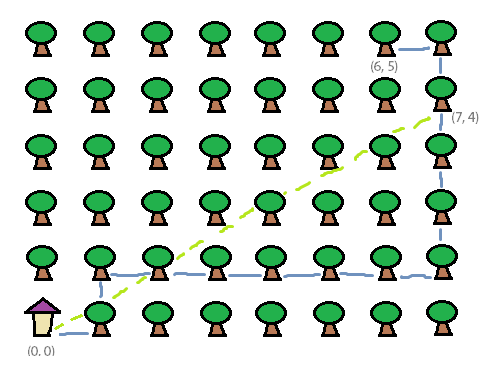

## 문제

용훈이는 격자 숲 안에서 길을 잃어버렸다. 다행히도 용훈이는 느지막이 보이는 자신의 집을 이용해서 자기 위치를 파악했다. 용훈이의 현재 위치는 집으로부터 동쪽으로 x만큼, 북쪽으로 y만큼 떨어져 있다.

용훈이는 동, 서, 남, 북 중 한 가지 방향으로 이동하면서 집까지 갈 것이다. 용훈이는 한 번 이동하기 시작하면 다른 나무(또는 집)에 도달할 때까지 계속 이동한다. 용훈이가 가장 가까운 두 나무 사이의 거리를 움직이는 데 1의 시간이 걸린다. 한편, 용훈이가 계속 방향감각을 유지하기 위해서는 용훈이가 거치는 모든 나무에서 용훈이의 집이 보여야 한다.

용훈이의 처음 좌표가 주어졌을 때 용훈이가 집까지 갈 수 있는 가장 짧은 시간을 구하는 프로그램을 작성하여라. 나무와 집의 크기는 매우 작아서 점으로 간주한다.

## 입력

첫 번째 줄에 현재 용훈이의 x-좌표와 y-좌표가 주어진다. (0 ≤ x, y ≤ 108)

용훈이의 처음 위치에서 자신의 집을 볼 수 있다는 것은 보장된다.

## 출력

첫 번째 줄에 용훈이가 자신의 집까지 갈 수 있는 최단시간을 출력한다. 만약 용훈이가 집까지 갈 수 없다면 -1을 출력한다.
