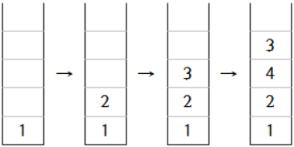
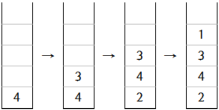

## 문제

찬식이와 찬식이의 동생 민식이는 젤리를 좋아한다. 찬식이는 친구 홍빈이네 집에 갔다 오는 길에 민식이와 같이 먹을 젤리를 사려고 한다. 찬식이네 집과 홍빈이네 집 사이에는 총 N개의 젤리 가게가 있다. 찬식이는 이 N개의 가게를 자기 집과 가까운 순서대로 1~N의 번호를 매겼다. 찬식이는 홍빈이를 만나기 전에 1~N번 가게에서 젤리를 순서대로 사거나, 홍빈이를 만난 후 돌아오는 길에 N~1번 가게에서 젤리를 순서대로 살 수 있다.

찬식이는 집에 돌아와서 맛있는 젤리만 후딱 먹고 프로그래밍 공부를 해야 하기 때문에 젤리 가게에서 젤리를 살 때마다 아래와 같은 방식으로 젤리 보관함을 정리한다.

1. 가장 위에 있는 젤리가 새로 산 젤리보다 맛있다면 그 젤리를 꺼낸다.
2. 1번 작업을 젤리를 다 꺼내거나 새로 산 젤리가 가장 위에 있는 젤리보다 더 맛있을 때까지 반복한다.
3. 새로 산 젤리를 보관함에 넣는다. 젤리는 위로 넣어진다.
4. 새로 산 젤리를 넣기 전에 꺼냈던 젤리를 나중에 꺼낸 순서대로 다시 보관함에 넣는다.

찬식이는 최근에 정렬 알고리즘을 배웠기 때문에 일반적인 경우에는 이 방법을 사용하면 젤리를 어떤 순서대로 사더라도 젤리들이 맛있는 순서(맛있는 젤리가 위쪽으로)대로 넣어진다는 것을 알고 있다. 하지만 찬식이의 취향은 논리적으로 따지면 모순인 경우가 있을 수 있다. 예를 들어, 찬식이가 오렌지맛 젤리보다 레몬맛 젤리를 더 좋아하고 레몬맛 젤리보다는 딸기맛 젤리를 더 좋아하고, 딸기맛 젤리보다 오렌지맛 젤리를 더 좋아하는 경우 논리적으로 모순이 될 수 있다. 이런 경우 젤리를 사는 순서에 따라 젤리가 보관되는 순서가 다를 수 있다.

찬식이가 N=4개의 젤리 가게에서 젤리를 사고, 찬식이의 취향이 아래와 같다고 하자. (A < B이면 B가 더 맛있다는 뜻)

* 젤리 1 < 젤리 2, 젤리 1 > 젤리 3, 젤리 1 < 젤리 4
* 젤리 2 < 젤리 3, 젤리 2 < 젤리 4, 젤리 3 > 젤리 4

만약 찬식이가 홍빈이를 만나기 전에 젤리를 사면 젤리 보관함이 아래 그림과 같이 채워진다.



반면, 찬식이가 홍빈이를 만난 후에 젤리를 사면 젤리 보관함이 아래 그림과 같이 채워진다.



찬식이는 자신의 취향을 토대로, 젤리를 모두 산 후 젤리 보관함의 상태로 가능한 두 가지 경우를 추측하였다. 찬식이는 ‘혹시 젤리 보관함으로 가능한 상태만 알면 남들이 내 취향을 알 수 있지 않을까’라는 생각이 들어, 젤리 보관함으로 가능한 두 가지 상태를 입력받고 자신의 취향을 추측하는 프로그램을 짰다.

찬식이는 정보를 조금 덜 알고도 자신의 취향을 알 수 있을지 궁금해졌다. 찬식이가 홍빈이를 만나기 전에 젤리를 샀을 때 젤리 보관함의 상태와 찬식이가 홍빈이를 만난 후 젤리를 샀을 때 가장 위에 있는 젤리가 주어질 때 찬식이의 취향을 추측하는 프로그램을 작성하여라.

## 입력

첫 번째 줄에는 젤리 가게의 수 N이 주어진다. (1 ≤ N ≤ 3,000)

두 번째 줄에는 찬식이가 홍빈이를 만나기 전에 젤리를 살 때 젤리 보관함에 있는 N개의 젤리의 번호가 가장 위의 젤리부터 순서대로 주어진다. k번 젤리는 k번 가게에서 산 젤리를 의미한다.

세 번째 줄에는 찬식이가 홍빈이를 만난 후에 젤리를 살 때 젤리 보관함의 가장 위쪽에 있는 젤리의 번호가 주어진다.

항상 답이 존재하는 입력만 주어진다.

## 출력

첫 번째 줄에는 찬식이의 취향으로 가능한 경우의 수를 1,000,000,007로 나눈 나머지를 출력한다.

두 번째 줄부터 N개의 줄에는 찬식이의 취향으로 가능한 것 중 하나를 출력한다. 답은 N개의 줄에 걸쳐서 출력한다. i번째 줄의 j번째 값은 i번 젤리가 j번 젤리보다 더 맛있다면 '1', j번 젤리가 i번 젤리보다 더 맛있다면 '0', i=j라면 '.'이다.

참고로 아무런 조건이 없는 경우 찬식이의 취향으로 가능한 경우의 수는 2^N(N-1)/2이다.

## 힌트

아래 표도 찬식이의 취향이 될 수 있다.

```

.011
1.00
01.1
010.
```
