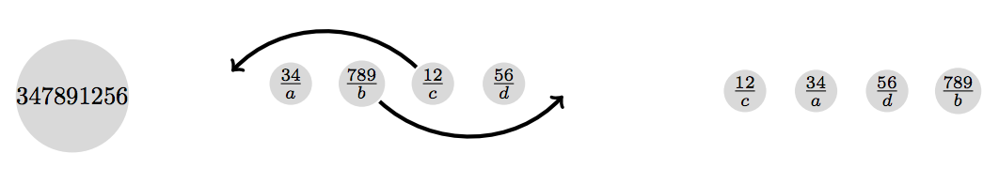
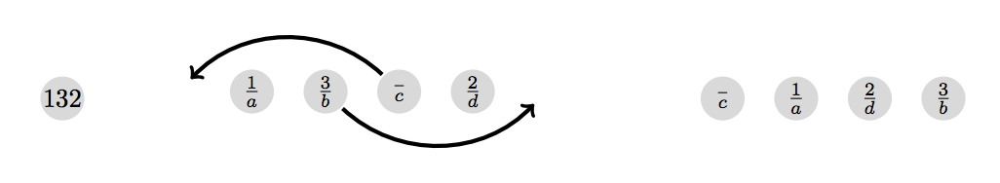

## 문제

Cheeseburgers are serious business. They are the most delicious food on earth, but there is a lot of room for error when making a cheeseburger. Even otherwise capable cooks often mess up the order of the assembled ingredients.

The only correct order of ingredients between the buns is, of course, as following from top to bottom:

1. Ketchup & Mustard
2. Beef Tomato
3. Pickles
4. Red Onions
5. Cheddar Cheese
6. Garlic
7. Salt & Pepper
8. Beef Patty, medium grilled
9. Corn Salad
10. Mayonnaise

Any deviation from this order is completely unacceptable. Therefore it is sometimes necessary to reassemble a cheeseburger.

Space on an average plate and social norms are rather restrictive when it comes to operating on a cheeseburger. The only feasible operation is the bit-shuffle (burger-ineptly-transformed). The bit-shuffle separates the entire burger into four parts of contiguous ingredients a, b, c and d and arranges them in the new order c a d b. The size of each of the four parts is selectable and may be zero.

Since the burger cools rapidly we are interested in the minimum required bit-shuffles to arrive at an acceptable burger.

Each given cheeseburger consists of n unique ingredients labeled from 1 to n. The correct order is always the natural order 1 2 . . . n.

Figure B.1: Illustration of the first sample input.

Figure B.2: Illustration of the second sample input.

## 입력

The input consists of:

* one line with an integer n (1 ≤ n ≤ 10), where n is the number of ingredients used;
* one line with n integers describing the order of the ingredients of the given cheeseburger. The ingredients are numbered from 1 to n.

## 출력

Output the minimum number of bit-shuffles to correct the given cheeseburger.
