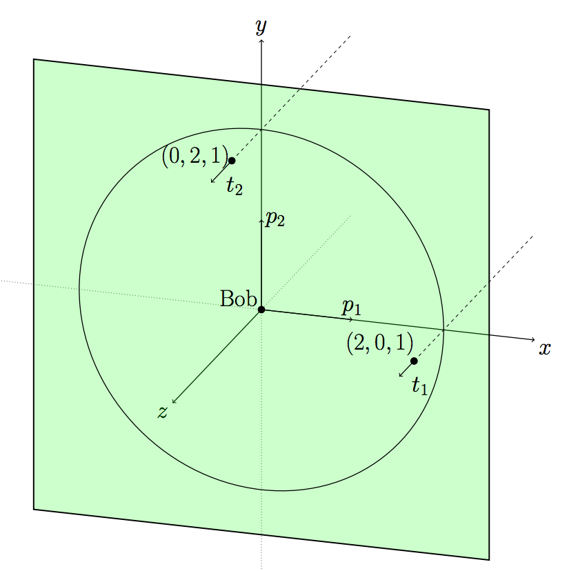
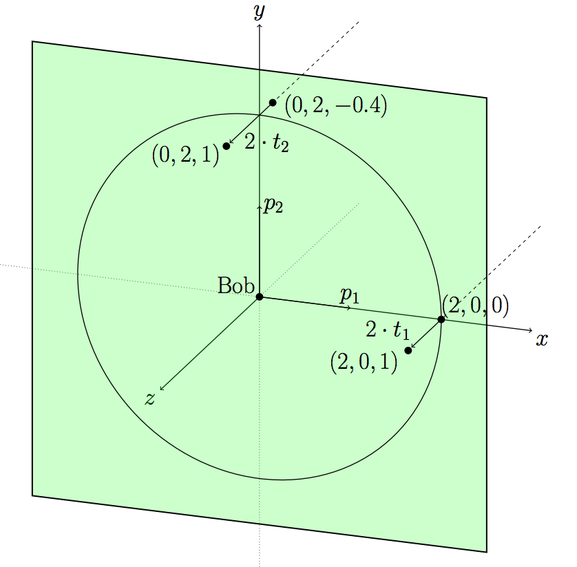

## 문제

In the distant future humanity has developed into a highly evolved race with vast knowledge of the universe. In particular, they now have an exhaustive map of all stars in the universe and know their trajectory as well as their speed.

Bob works at the center for interplanetary communication. This is usually the most boring job on the planet, since you sit around all day waiting for other yet unknown races to send messages. Today however, as Bob comes back from his daily ping-pong session, he sees a red light blinking away in his control station. As the light is very annoying and keeps him from napping, he decides to look up its meaning in his manual. It says:

> Congratulations! You have just made contact with another race. Please submit the coordinates of the newly discovered race to the administration office for proper filing. They can be found on panel 42.

“Neat!” Bob thinks and takes a look at panel 42. Unfortunately, something seems to be broken since instead of showing the coordinates it shows two vectors, a number and “Warning 54816”. Another look at the manual reveals:

> Warning 54816: Something went wrong while calculating the exact coordinates of the message’s origin. Instead a plane from which the message must have come from as well as the origin’s distance were computed.

After a quick check, Bob finds out that there are quite a few stars whose trajectories intersect with the plane at the given distance, but none that intersect at a slightly different distance (up to 0.1 lightyears). Also, stars which have not been in the plane at the time of the signal transmission were at a distance of at least 0.1 lightyears to the plane. Furthermore, the trajectories of all stars seem to intersect the given plane at an angle between 10 and 90 degrees.

Since Bob wants to plan his afternoon, he first wants to know how many stars he needs to check individually to find out from which one the message originated.

Can you help Bob figure out how many stars fit the description?

## 입력

The input consists of:

* one line with an integer n (1 ≤ n ≤ 104) and a real number d (1.0 ≤ d ≤ 105), where n is the number of stars in the universe and d is the distance from Bob to the message’s origin;
* two lines each with three real numbers px, py, and pz (0.0 ≤ px, py, pz ≤ 10.0, |(px, py, pz)| ≥ 0.1) describing a vector (px, py, pz), where the two vectors span a plane from Bob’s location in which the message’s origin must have been in when the message was sent;
* 2n lines describing the stars. Each star is described by:
  + one line with three real numbers sx, sy, and sz (−1 · 106 ≤ sx, sy, sz ≤ 106) where (sx, sy, sz) describes the current location of the star;
  + one line with three real numbers tx, ty, and tz (0.1 ≤ |(tx, ty, tz)| ≤ 0.95) where (tx, ty, tz) describes the trajectory of the star. |(tx, ty, tz)| gives the speed at which the star is traveling.

You can assume the following:

* The other civilization’s message travels at the speed of light.
* All speeds are given in lightyears per year, and distances are in lightyears.
* Bob’s location is fixed at (0, 0, 0).
* Stars never collide.
* There are no intersection points of the given plane and any trajectory at distance d ± 0.1 lightyears except for intersection points at distance exactly d lightyears.
* Stars which have not been in the plane at the time of the signal transmission were at a distance of at least 0.1 lightyears to the plane.
* All trajectories intersect the given plane at an angle between 10 and 90 degrees.

## 출력

Output the number of stars that fit the description.

## 힌트

In the first sample we need to check 2 stars. The star positions in the present as well as the given plane and the trajectories of the stars are shown in figure 1. The plane from which the message originated is given by the vectors (1.0, 0.0, 0.0) and (0.0, 1.0, 0.0), the distance is 2.0. The first star is currently at position (2.0, 0.0, 1.0) and moves in direction (0.0, 0.0, 1.0) with speed 0.5. The second star is currently at position (0.0, 2.0, 1.0) and moves in direction (0.0, 0.0, 1.0) with speed 0.7. After moving the stars back by 2 years the stars’ positions are as shown in Figure H.2. As we can see, star 1 is in the plane and has the correct distance to Bob, therefore it fits the description. Star 2 is not in the plane and therefore does not fit the description. Hence the correct answer for the first sample is 1.

Figure H.1: Star positions in the present for the first sample input.

Figure H.2: Star positions two years ago for the first sample input.
