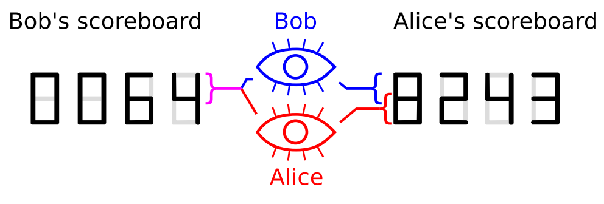

## 문제

Alice and Bob play some game in which they score points. Each of the two has an n-digit scoreboard which depicts numbers in base 10 (with leading zeroes). The digits 0 to 9 are displayed on a seven-segment display in the following fashion:

For some odd reason, the two players cannot see the scoreboards entirely. Alice can only see the lower half of her own scoreboard and the upper half of Bob’s scoreboard. Bob can only see the upper half of his scoreboard and the upper half of Alice’s scoreboard. Here, ‘half’ is meant to include the horizontal segments in the digits’ centers: they can be seen by both players at all times. For example, if one sees the upper half of an eight, one can conclude that the digit is not a zero.

Figure I.1: An example situation for n = 4.

A pair of n-digit scores is called fully known if both players know both scores (i.e. all 2n digits) by looking at the displays with their restricted vision. The players cannot communicate.

## 입력

The input consists of:

* one line with an integer n (1 ≤ n ≤ 20), where n is the number of digits.

## 출력

Output the number of score pairs that can be displayed on two n-digit scoreboards and are fully known by both players.
