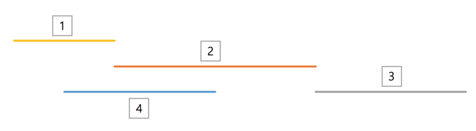

## 문제

그래프 이론에서 클리크란, 완전 그래프인 부분 그래프를 의미한다. 즉, 정점으로 이루어진 집합 중 모든 두 정점 사이에 간선이 있는 집합을 의미한다. 최대 클리크는 그러한 집합 중 크기가 가장 큰 집합을 말한다. 일반적인 그래프에서 최대 클리크를 구하는 문제는 NP-hard 이다.

N개의 구간이 있다. i번 구간의 시작점은 Si, 끝점은 Ei이며, 어떤 두 구간이 한 점 이상을 공유하면 이 두 구간을 ‘겹친다’고 표현한다. 이때 우리는 구간 그래프를 정의할 수 있다. 구간 그래프란, N개의 정점이 있고, i번 구간과 j번 구간이 겹칠 때, i번 정점과 j번 정점 사이에 간선이 존재하는 그래프다. 만약 두 구간이 겹치지 않는다면 i번 정점과 j번 정점 사이에 존재하는 간선은 없다.

예를 들어 위와 같이 N개의 구간이 있을 때 이를 구간 그래프로 나타내면 아래와 같다.

이때 이 구간 그래프의 최대 클리크는 {1, 2, 4}이다.

N개의 구간이 주어졌을 때, 이에 대한 구간 그래프의 최대 클리크를 구하시오.

## 입력

입력의 첫 줄에는 구간의 수를 나타내는 자연수 N(1 ≤ N ≤ 300,000)이 주어진다. 다음 N개의 줄에 각 구간의 시작점과 끝점을 나타내는 두 자연수 Si, Ei가 공백으로 구분되어 주어진다. (1 ≤ Si < Ei ≤ 109)

## 출력

첫 줄에 최대 클리크의 크기 s를 출력한다. 둘째 줄에는 클리크에 있는 정점들의 번호 s개를 공백으로 구분하여 출력한다. 출력 순서는 상관없으며, 만약 최대 클리크가 여러 가지인 경우 그 중 아무거나 출력한다.
