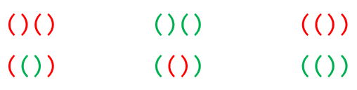

## 문제

**올바른 괄호 문자열**이란 다음과 같은 문자열의 집합이다.

* 빈 문자열은 올바른 괄호 문자열이다.
* S가 올바른 괄호 문자열이면 (S)도 올바른 괄호 문자열이다. 즉 올바른 괄호 문자열의 앞에 여는 괄호를 붙이고 뒤에 닫는 괄호를 붙여도 올바른 괄호 문자열이다.
* S와 T가 올바른 괄호 문자열이면 ST도 올바른 괄호 문자열이다. 즉 올바른 괄호 문자열을 이어 붙여도 올바른 괄호 문자열이다.

그는 괄호 문자열을 매우 좋아한다. 하지만 괄호의 종류를 하나만 사용해왔던 것이 너무 재미가 없어서 서로 구별할 수 있는 K 개의 색을 괄호에 칠하기로 했다. 예를 들어 K = 3 이고 빨간색, 녹색, 파란색을 사용하기로 했다면 위의 정의에서 두 번째 부분이 아래처럼 확장된다.

* S가 올바른 괄호 문자열이면 **(**S**)**, **(**S**)**, **(**S**)**도 올바른 괄호 문자열이다. 즉 올바른 괄호 문자열의 앞에 여는 괄호를 붙이고 뒤에 닫는 괄호를 붙여도 올바른 괄호 문자열이다.

K 가 더 늘어나면 구별 가능한 색을 더 추가해서 정의를 확장하면 된다. 이제 2N 개의 괄호를 사용하여 만든 올바른 문자열 중에서 자기 자신과 자기 자신을 뒤집은 문자열이 같은 것들의 개수를 구하는 프로그램을 작성하라. 어떤 문자열을 뒤집는다는 것은 문자열을 거울에 비춘 다음 거울에 비친 모양대로 적는다는 것과 같다. 예를 들어 **(****()****)****()**를 뒤집으면 **()****(****()****)**가 될 것이다. 이 문자열은 자기 자신과 뒤집은 문자열이 같지 않으므로 세면 안 된다. **()****(****()****)****()**는 뒤집어도 똑같이 **()****(****()****)****()**가 될 것이므로 개수를 세어야 한다.

## 입력

첫 번째 줄에는 사용하는 괄호의 개수와 괄호의 색을 나타내는 두 자연수 N, K 가 공백으로 구분되어 주어진다. (1 ≤ N ≤ 106, 1 ≤ K ≤ 106)

## 출력

K 종류의 괄호를 2N 개 사용해 올바른 괄호 문자열을 만들었을 때, 자기 자신과 자기 자신을 뒤집은 문자열이 같은 것들의 개수를 출력한다. 이 수는 매우 커질 수 있으므로 1,000,000,007로 나눈 나머지를 출력해야 한다.

## 힌트

다음의 6가지 경우가 있을 수 있다.

