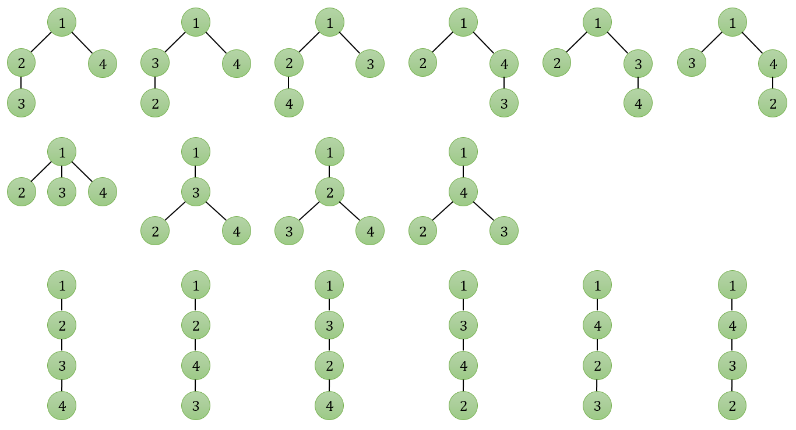
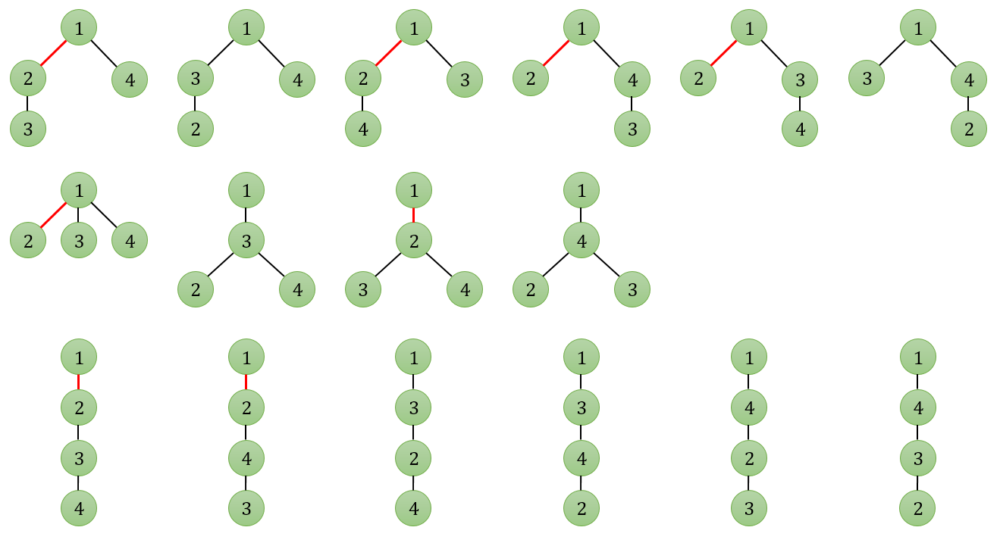

## 문제

트리란 그래프의 일종으로 어떤 두 정점을 잇는 경로가 정확히 하나만 있는 방향성 없는 그래프를 뜻한다. 다른 말로 하자면, 모든 정점이 연결되어 있으며 사이클이 없는 그래프이다. N 개의 구별할 수 있는 정점을 가진 트리를 만들 수 있는 경우의 수를 생각해보자. 정점에 1 에서 N 까지의 번호를 붙이면, 간선이 어떤 두 정점을 연결하는지에 따라 경우를 구분할 수 있게 된다. 예를 들어 N=4 인 경우 다음과 같이 16 가지의 트리가 있을 수 있다.

N 개의 구별할 수 있는 정점을 가진 트리 중에서 특정한 M 개의 간선을 포함하는 트리의 개수를 구하는 프로그램을 작성하라.

## 입력

첫 번째 줄에는 트리의 정점 개수와 포함해야 하는 간선의 개수를 나타내는 두 정수 N, M이 공백으로 구분되어 주어진다. 다음 M 개의 줄에는 포함해야 하는 간선의 양 끝점 a, b (1 ≤ a, b ≤ N )이 주어진다. a와 b는 다른 수이며 같은 간선이 여러 번 주어지는 일은 없다. 주어진 간선을 모두 포함하는 트리를 만들지 못할 수도 있다. (1 ≤ N ≤ 109, 0 ≤ M ≤ 105)

## 출력

주어진 간선을 모두 포함하는 트리의 개수를 출력한다. 이 수는 매우 커질 수 있으므로 1,000,000,007로 나눈 나머지를 출력해야 한다.

## 힌트

위 그림에서 1과 2를 연결하는 간선을 빨간 색으로 칠하였다. 이런 간선을 포함하는 트리는 8개 밖에 없음을 알 수 있다.
