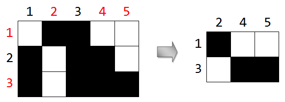

## 문제

1 × 1 크기의 정사각형 H × W 개로 이루어진 직사각형이 있다. 즉, 이 직사각형은 H 개의 행과 W 개의 열을 가지고 균등한 1 × 1 크기의 정사각형으로 나뉘어 있는 것이다. 각 정사각형은 흑색으로 칠해져 있거나 백색으로 칠해져 있을 수 있으며, 그 확률은 각각 50%이다.

이 직사각형에서 부분 직사각형이라는 것을 정의한다. 부분 직사각형은 한 개 이상의 행을 선택하고 한 개 이상의 열을 선택하여 이 행이나 열에 포함되지 않는 모든 정사각형을 제외하여 만드는 직사각형이다. 예를 들어 3 × 5 크기의 직사각형이 적절히 칠해져 있다고 하자. 첫 번째, 세 번째 행을 선택하고 두 번째, 네 번째, 다섯 번째 열을 선택하면 다음과 같이 선택되는 것이다.

부분 직사각형에 칠해진 구성이 같아도 선택한 행과 열 중에서 하나라도 다른 것이 있다면 다른 경우로 생각한다. 부분 직사각형을 만들었을 때, 포함된 모든 칸의 색이 흑색이면 흑색 부분 직사각형, 백색이면 백색 부분 직사각형이라고 하자. 흑색 부분 직사각형의 개수와 백색 부분 직사각형의 개수를 곱한 값의 기댓값을 구하는 프로그램을 작성하라.

## 입력

첫 번째 줄에는 직사각형의 크기를 나타내는 두 자연수 H 와 W 가 공백 하나로 구분되어 주어진다. (1 ≤ H, W ≤ 103)

## 출력

흑색 부분 직사각형의 개수와 백색 부분 직사각형의 개수를 곱한 값의 기댓값을 출력한다. 정확한 판별을 위해, 답을 기약분수로 나타내었을 때 a/b가 된다면, (a × b-1) mod 1,000,000,007을 대신 출력하도록 한다. b-1은 b의 모듈러 곱셈에 대한 역원이다. 이 문제에서는 가능한 모든 입력에 대해 답이 존재한다.
