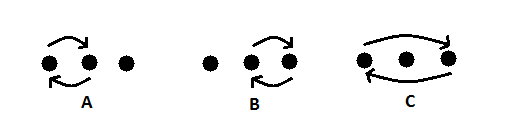

## 문제

Oisín is amateur magician and is big fan of Chop Cup routine which involves three cups face down and one ball underneath one of the cups. He's only started to practice the trick and wants to test out if you can follow where the ball is without any tricks or slight of hand.

The ball starts under the leftmost cup and Oisín then swaps two cups in one of three possible ways a number of times.

What Oisin doesn't realise is that you are recording the moves with your phone using the letters A, B or C and are going to use a simple program to determine where the ball is. Write that program.

## 입력

The first and only line contains a string of at most 50 characters, Oisín's moves.

Each of the characters is 'A', 'B' or 'C' (without quote marks).

## 출력

Output the index of the cup under which the ball is: 1 if it is under the left cup, 2 if it is under the middle cup or 3 if it is under the right cup.
