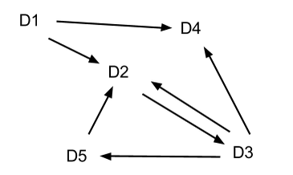

## 문제

We are analyzing how the domains on the Internet connect to each other. A domain is the part of a URL that comes before the / character. Examples of domains are: twitter.com, aipo.computing.dcu.ieor google.com. A domain d1 is connected to a domain d2 if there is a link from d1 to d2 or if d1 is connected to a domain d3 and d3 is connected to d2. We consider that a domain is connected to itself. In the following structure of domains:

* D1 is connected to D2, D3 (through D2), D4 and D5 (through D3).
* D2 is connected to D3, D4 (through D3) and D5 (through D3).
* D3 is connected to D2, D4 and D5.
* D4 is not connected to any other domain.
* D5 is connected to D2, D3 (through D2) and D4 (through D3).

We want to obtain the biggest subset of domains S where each domain in S is connected to all the other domains in S. In the example above we have the following subsets that meet this criteria:

* D1: Connected to itself.
* D2, D3, D5: We can arrive from D2 to D3 and D5, from D3 to D2 and D5 and from D5 to D2 and D3.
* D4: Connected to itself.

Please, given the links of the Internet, compute the size of the biggest subset.

## 입력

The first line will contain an integer D representing the number of domains. The names of the domains will be integers from 1 to D. (1 ≤ D ≤ 5000)

The second line will contain an integer L representing the number of links between domains. The following L lines will contain two integers each. The first integer is the source of the link and the second is the destination. Remember that a link from A to B does not imply a link from B to A and that every domain is connected to itself without the need of an explicit link. No link will appear more than once. (0 ≤ L ≤ D2)

## 출력

The size of the biggest subset of domains that meet the criteria above. If two or more subsets are tied for the biggest size, print the size of any of them.
