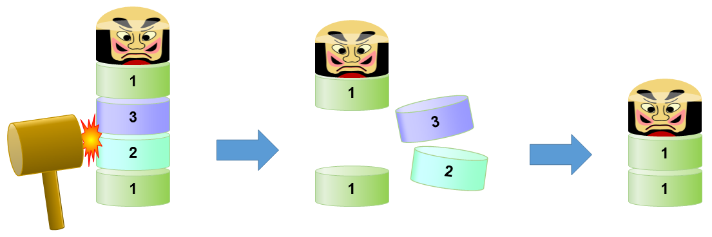

## 문제

You are playing a variant of a game called "Daruma Otoshi (Dharma Block Striking)".

At the start of a game, several wooden blocks of the same size but with varying weights are stacked on top of each other, forming a tower. Another block symbolizing Dharma is placed atop. You have a wooden hammer with its head thicker than the height of a block, but not twice that.

You can choose any two adjacent blocks, except Dharma on the top, differing at most 1 in their weight, and push both of them out of the stack with a single blow of your hammer. The blocks above the removed ones then fall straight down, without collapsing the tower. You cannot hit a block pair with weight difference of 2 or more, for that makes too hard to push out blocks while keeping the balance of the tower. There is no chance in hitting three blocks out at a time, for that would require superhuman accuracy.

The goal of the game is to remove as many blocks as you can. Your task is to decide the number of blocks that can be removed by repeating the blows in an optimal order.



Figure D1. Striking out two blocks at a time

In the above figure, with a stack of four blocks weighing 1, 2, 3, and 1, in this order from the bottom, you can hit middle two blocks, weighing 2 and 3, out from the stack. The blocks above will then fall down, and two blocks weighing 1 and the Dharma block will remain. You can then push out the remaining pair of weight-1 blocks after that.

## 입력

The input consists of multiple datasets. The number of datasets is at most 50. Each dataset is in the following format.

```

n 
w1 w2 … wn
```

n is the number of blocks, except Dharma on the top. n is a positive integer not exceeding 300. wi gives the weight of the i-th block counted from the bottom. wi is an integer between 1 and 1000, inclusive.

The end of the input is indicated by a line containing a zero.

## 출력

For each dataset, output in a line the maximum number of blocks you can remove.
