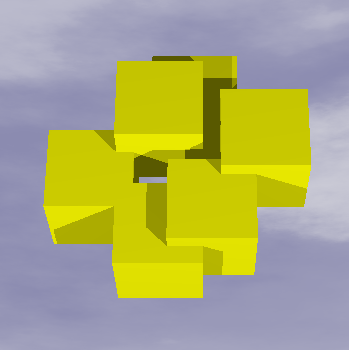

## 문제

We are designing an installation art piece consisting of a number of cubes with 3D printing technology for submitting one to Installation art Contest with Printed Cubes (ICPC). At this time, we are trying to model a piece consisting of exactly k cubes of the same size facing the same direction.

First, using a CAD system, we prepare n (n ≥ k) positions as candidates in the 3D space where cubes can be placed. When cubes would be placed at all the candidate positions, the following three conditions are satisfied.

* Each cube may overlap zero, one or two other cubes, but not three or more.
* When a cube overlap two other cubes, those two cubes do not overlap.
* Two non-overlapping cubes do not touch at their surfaces, edges or corners.

Second, choosing appropriate k different positions from n candidates and placing cubes there, we obtain a connected polyhedron as a union of the k cubes. When we use a 3D printer, we usually print only the thin surface of a 3D object. In order to save the amount of filament material for the 3D printer, we want to find the polyhedron with the minimal surface area.

Your job is to find the polyhedron with the minimal surface area consisting of k connected cubes placed at k selected positions among n given ones.



Figure E1. A polyhedron formed with connected identical cubes.

## 입력

The input consists of multiple datasets. The number of datasets is at most 100. Each dataset is in the following format.

```

n k s
x1 y1 z1
... 
xn yn zn
```

In the first line of a dataset, n is the number of the candidate positions, k is the number of the cubes to form the connected polyhedron, and s is the edge length of cubes. n, k and s are integers separated by a space. The following n lines specify the n candidate positions. In the i-th line, there are three integers xi, yi and zi that specify the coordinates of a position, where the corner of the cube with the smallest coordinate values may be placed. Edges of the cubes are to be aligned with either of three axes. All the values of coordinates are integers separated by a space. The three conditions on the candidate positions mentioned above are satisfied.

The parameters satisfy the following conditions: 1 ≤ k ≤ n ≤ 2000, 3 ≤ s ≤ 100, and -4×107 ≤ xi, yi, zi ≤ 4×107.

The end of the input is indicated by a line containing three zeros separated by a space.

## 출력

For each dataset, output a single line containing one integer indicating the surface area of the connected polyhedron with the minimal surface area. When no k cubes form a connected polyhedron, output -1.
