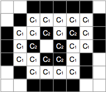
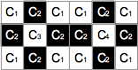
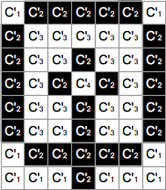

## 문제

Image data which are left by a mysterious syndicate were discovered. You are requested to analyze the data. The syndicate members used characters invented independently. A binary image corresponds to one character written in black ink on white paper.

Although you found many variant images that represent the same character, you discovered that you can judge whether or not two images represent the same character with the surrounding relation of connected components. We present some definitions as follows. Here, we assume that white pixels fill outside of the given image.

* White connected component : A set of white pixels connected to each other horizontally or vertically (see below).
* Black connected component : A set of black pixels connected to each other horizontally, vertically, or diagonally (see below).
* Connected component : A white or a black connected component.
* Background component : The connected component including pixels outside of the image. Any white pixels on the periphery of the image are thus included in the background component.

|  |  |  |  |
| --- | --- | --- | --- |
|  |  |  |  |
| connected | disconnected | connected | connected |
| Connectedness of white pixels | | Connectedness of black pixels | |

Let C1 be a connected component in an image and C2 be another connected component in the same image with the opposite color. Let's think of a modified image in which colors of all pixels not included in C1 nor C2 are changed to that of C2. If neither C1 nor C2 is the background component, the color of the background component is changed to that of C2. We say that C1 surrounds C2 in the original image when pixels in C2 are not included in the background component in the modified image. (see below)



Two images represent the same character if both of the following conditions are satisfied.

* The two images have the same number of connected components.
* Let S and S' be the sets of connected components of the two images. A bijective function f : S → S' satisfying the following conditions exists.
  + For each connected component C that belongs to S, f (C) has the same color as C.
  + For each of C1 and C2 belonging to S, f (C1) surrounds f (C2) if and only if C1 surrounds C2.

Let's see an example. Connected components in the images of the figure below has the following surrounding relations.

* C1 surrounds C2.
* C2 surrounds C3.
* C2 surrounds C4.
* C'1 surrounds C'2.
* C'2 surrounds C'3.
* C'2 surrounds C'4.

A bijective function defined as f (Ci) = C'i for each connected component satisfies the conditions stated above. Therefore, we can conclude that the two images represent the same character.



Make a program judging whether given two images represent the same character.

## 입력

The input consists of at most 200 datasets. The end of the input is represented by a line containing two zeros. Each dataset is formatted as follows.

```

image 1
image 2
```

Each image has the following format.

```

h w
p(1,1) ... p(1,w)
...
p(h,1) ... p(h,w)
```

h and w are the height and the width of the image in numbers of pixels. You may assume that 1 ≤ h ≤ 100 and 1 ≤ w ≤ 100. Each of the following h lines consists of w characters. p(y,x) is a character representing the color of the pixel in the y-th row from the top and the x-th column from the left. Characters are either a period (".") meaning white or a sharp sign ("#") meaning black.

## 출력

For each dataset, output "yes" if the two images represent the same character, or output "no", otherwise, in a line. The output should not contain extra characters.
