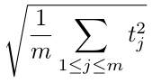

## 문제

The warp drive technology is reforming air travel, making the travel times drastically shorter. Aircraft reaching above the warp fields built on the ground surface can be transferred to any desired destination in a twinkling.

With the current immature technology, however, building warp fields is quite expensive. Our budget allows building only two of them. Fortunately, the cost does not depend on the locations of the warp fields, and we can build them anywhere on the ground surface, even at an airport.

Your task is, given locations of airports and a list of one way flights among them, find the best locations to build the two warp fields that give the minimal average cost. The average cost is the root mean square of travel times of all the flights, defined as follows.



Here, m is the number of flights and tj is the shortest possible travel time of the j-th flight. Note that the value of tj depends on the locations of the warp fields.

For simplicity, we approximate the surface of the ground by a flat two dimensional plane, and approximate airports, aircraft, and warp fields by points on the plane. Different flights use different aircraft with possibly different cruising speeds. Times required for climb, acceleration, deceleration and descent are negligible. Further, when an aircraft reaches above a warp field, time required after that to its destination is zero. As is explained below, the airports have integral coordinates. Note, however, that the warp fields can have non-integer coordinates.

## 입력

The input consists of at most 35 datasets, each in the following format.

```

n m 
x1 y1 
... 
xn yn 
a1 b1 v1 
... 
am bm vm
```

n is the number of airports, and m is the number of flights (2 ≤ n ≤ 20, 2 ≤ m ≤ 40). For each i, xi and yi are the coordinates of the i-th airport. xi and yi are integers with absolute values at most 1000. For each j, aj and bj are integers between 1 and n inclusive, and are the indices of the departure and arrival airports for the j-th flight, respectively. vj is the cruising speed for the j-th flight, that is, the distance that the aircraft of the flight moves in one time unit. vj is a decimal fraction with two digits after the decimal point (1 ≤ vj ≤ 10).

The following are guaranteed.

* Two different airports have different coordinates.
* The departure and arrival airports of any of the flights are different.
* Two different flights have different departure airport and/or arrival airport.

The end of the input is indicated by a line containing two zeros.

## 출력

For each dataset, output the average cost when you place the two warp fields optimally. The output should not contain an absolute error greater than 10-6.
