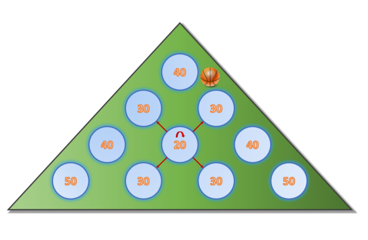

## 문제

Have you recently visited an arcade? Arcade games seem to have become more boring over the years, requiring less and less skill. In fact, most arcade games these days seem to depend entirely on luck. Consider the arcade game shown in the picture, which consists of different holes arranged in a triangular shape. A ball is dropped near the hole at the top. The ball either falls into the hole, in which case the game ends, or it bounces to one of its (up to) 4 neighbors, denoted by the red arrows. Different holes have different payouts — some may even be negative! If the ball reaches another hole, the process repeats: the ball either falls into the hole, ending the game — or it bounces to one of its neighbors, possibly ad infinitum!

Write a program that computes the expected payout when dropping a ball into the machine!

## 입력

The input consists of a single test case. The first line contains an integer N (1 ≤ N ≤ 32) describing the number of rows of the arcade machine. The second line contains H = N(N + 1)/2 integers vi (−100 ≤ vi ≤ 100) describing the payout (positive or negative) if the ball drops into hole i. Holes are numbered such that hole 1 is in the first row, holes 2 and 3 are in the second row, etc. The kth row starts with hole number k(k − 1)/2 + 1 and contains exactly k holes.

These two lines are followed by H lines, each of which contains 5 real numbers p0 p1 p2 p3 p4, denoting the probability that the ball bounces to its top-left (p0), top-right (p1), bottom-left (p2), or bottom-right (p3) neighbors or that the ball enters the hole (p4). Each probability is given with at most 3 decimal digits after the period. It is guaranteed that 0.0 ≤ pi ≤ 1.0 and Σpi = 1.0. If a hole does not have certain neighbors because it is located near the boundary of the arcade machine, the probability of bouncing to these non-existent neighbors is always zero. For instance, for hole number 1, the probabilities to jump to the top-left and top-right neighbors are both given as 0.0.

You can assume that after the ball has bounced b times, the probability that it has not fallen into a hole is at most (1 − 10−3)[b/H].

## 출력

Output a single number, the expected value from playing one game. Your answer is considered correct if its absolute or relative error is less than 10−4.

Hint: Using Monte Carlo-style simulation (throwing many balls in the machine and simulating which hole they fall into using randomly generated choices) does not yield the required accuracy!
