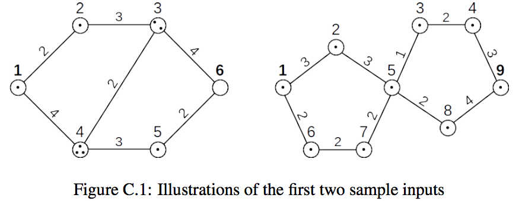

## 문제

Your boss has hired you to drive a big truck, transporting items between two locations in a city. You’re given a description of the city, with locations of interest and the lengths of roads between them. Your boss requires that you take a shortest path between the starting and ending location, and she’ll check your odometer when you’re done to make sure you didn’t take any unnecessary side trips. However, your friends know you have plenty of unused space in the truck, and they have asked you to stop by several locations in town, to pick up items for them. You’re happy to do this for them. You may not be able to visit every location to pick up everything your friends want, but you’d like to pick up as many items as possible on your trip, as long as it doesn’t make the path any longer than necessary.

The two graphs above show examples of what the city may look like, with nodes representing locations, edges representing roads and dots inside the nodes epresenting items your friends have asked you to pick up. Driving through a location allows you to pick up all the items there; it’s a big truck, with no limit on the items it can carry. In the graph on the left, for example, you have to drive the big truck from location 1 to location 6. If you follow the path 1 → 2 → 3 → 6, the length is 9, and you’ll get to pick up 4 items. Of course, it would be better to drive 1 → 4 → 5 → 6; that’s still a length of 9, but going this way instead lets you pick up an additional item. Driving 1 → 4 → 3 → 6 would let you pick up even more items, but it would make your trip longer, so you can’t go this way.

## 입력

The first line of input contains an integer, n (2 ≤ n ≤ 100), giving the number of locations in the city. Locations are numbered from 1 to n, with location 1 being the starting location and n being the destination. The next input line gives a sequence of n integers, t1 . . . tn, where each ti indicates the number of items your friends have asked you to pick up from location i. All the ti values are between 0 and 100, inclusive. The next input line contains a non-negative integer, m, giving the number of roads in the city. Each of the following m lines is a description of a road, given as three integers, a b d. This indicates that there is a road of length d between location a and location b. The values of a and b are in the range 1 . . . n, and the value of d is between 1 and 100, inclusive. All roads can be traversed in either direction, there is at most one road between any two locations, and no road starts and ends at the same location.

## 출력

If it’s not possible to travel from location 1 to location n, just output out the word “impossible”. Otherwise, output the length of a shortest path from location 1 to location n, followed by the maximum number of items you can pick up along the way.
