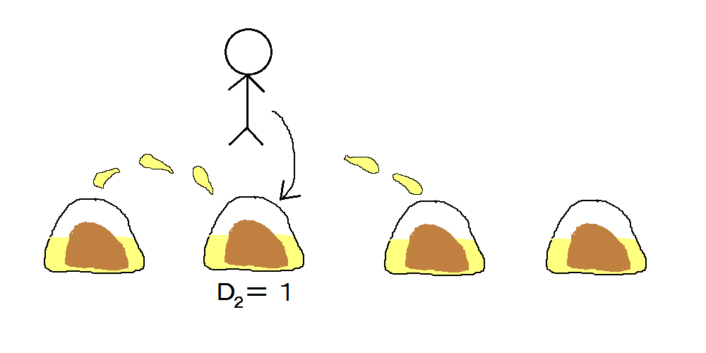

## 문제

JOI 君はお昼ごはんに，中華料理屋で小籠包を食べることにした． 小籠包とは，具と熱いスープを小麦粉の皮で包んだ料理であり，食べるときにスープが周囲に飛び散ることで知られている．

JOI 君が注文した小籠包のセットは，具やスープの異なる N 個の小籠包からなる． N 個の小籠包は等間隔に一列に並んでおり，順番に 1 から N の番号がつけられている． i 番目の小籠包と j 番目の小籠包の間の距離は絶対値 |i - j| である．

JOI 君は小籠包をある順番で食べていく． 最初，すべての小籠包のおいしさは 0 である． i 番目の小籠包を食べると，周囲にその汁が飛び散り，まだ食べられていない小籠包のうち，小籠包 i からの距離が Di 以下の小籠包に汁がかかる．汁がかかった小籠包はおいしさが Ai 増える．すなわち， i 番目の小籠包を食べたときに， j 番目の小籠包 (1 ≦ j ≦ N かつ i - Di ≦ j ≦ i + Di) がまだ食べられずに残っているならば， j 番目の小籠包のおいしさが Ai 増える．

JOI 君は，食べる順番を工夫することで，食べる小籠包のおいしさの合計を最大化したい． もっとも良い順番で食べたときの，JOI 君が食べる小籠包のおいしさの合計を求めるプログラムを作成せよ．

## 입력

入力ファイルは 3 行からなる．

1 行目には 1 つの整数 N (1 ≦ N ≦ 100) が書かれている．

2 行目には， N 個の整数 D1, D2, ..., DN (0 ≦ Di ≦ 7) が空白を区切りとして書かれている．

3 行目には， N 個の整数 A1, A2, ..., AN (0 ≦ Ai ≦ 1000) が空白を区切りとして書かれている．

## 출력

JOI 君が食べる小籠包のおいしさの合計の最大値を 1 行で出力せよ．

## 힌트

入出力例 1 では，5 番目 → 3 番目 → 1 番目 → 2 番目 → 4 番目 の順番で食べると， おいしさの合計が 20 になる．合計が 20 を超えるような食べ方は存在しないので，これが最善である．

※各入出力例のデータは， 右クリック等によりファイルに保存して利用可能です．
