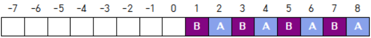
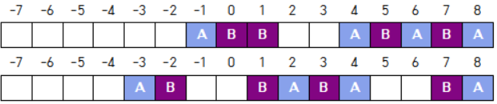
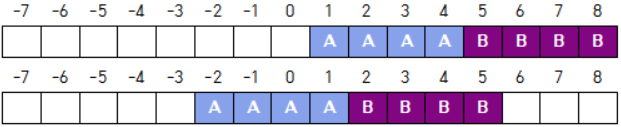

## 문제

1 × 4N 크기의 격자의 맨 오른쪽 2N개의 칸에 블록이 놓여있다.

당신은 격자에 있는 연속한 두 개의 블록을 집어서 빈 칸에 놓을 수 있다. 이때 블록의 순서는 바뀌면 안 되며 블록을 놓을 때도 연속한 두 개의 빈 칸에 놓아야 한다.

위 그림에서, 첫 번째 그림은 맨 처음 상태에서 한 번 블록을 옮겨서 나올 수 있는 형태이고, 두 번째 그림은 그렇지 않은 형태이다.

당신은 블록을 최소한으로 옮겨서 N개의 'A' 블록과 N개의 'B' 블록이 연속하게 붙은 형태로 만들려고 한다. 즉, 마지막 상태는 아래와 같은 형태 중 한 가지 모습이여야 한다.

(가능한 마지막 상태는 위 두 경우를 포함해서 총 9가지이다.)

'A' 블록의 개수가 주어질 때 블록을 어떻게 옮겨야 하는지 구하는 프로그램을 작성하여라. 단, 반드시 최소 횟수로 옮겨야 함에 유의하여라.

## 입력

첫 번째 줄에 N이 주어진다. (3 ≤ N ≤ 100)

## 출력

몇 개의 줄에 블록을 옮기는 과정을 'X to Y' 형식으로 출력한다. 'X to Y'는, X, X+1번 칸의 블록을 Y, Y+1번 칸으로 옮기는 것을 의미한다. (-2N+1 ≤ X, Y ≤ 2N-1, X ≠ Y)

답이 여러 개이면 그중 아무거나 출력해도 된다.
