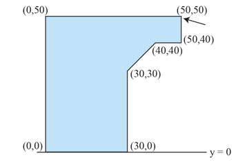

## 문제

Wherever there is large-scale construction, you will find cranes that do the lifting. One hardly ever thinks about what marvelous examples of engineering cranes are: a structure of (relatively) little weight that can lift much heavier loads. But even the best-built cranes may have a limit on how much weight they can lift.

The Association of Crane Manufacturers (ACM) needs a program to compute the range of weights that a crane can lift. Since cranes are symmetric, ACM engineers have decided to consider only a cross section of each crane, which can be viewed as a polygon resting on the x-axis.

Figure C.1: Crane cross section

Figure C.1 shows a cross section of the crane in the first sample input. Assume that every 1 × 1 unit of crane cross section weighs 1 kilogram and that the weight to be lifted will be attached at one of the polygon vertices (indicated by the arrow in Figure C.1). Write a program that determines the weight range for which the crane will not topple to the left or to the right.

## 입력

The input consists of a single test case. The test case starts with a single integer n (3 ≤ n ≤ 100), the number of points of the polygon used to describe the crane’s shape. The following n pairs of integers xi, yi (−2 000 ≤ xi ≤ 2 000, 0 ≤ yi ≤ 2 000) are the coordinates of the polygon points in order. The weight is attached at the first polygon point and at least two polygon points are lying on the x-axis.

## 출력

Display the weight range (in kilograms) that can be attached to the crane without the crane toppling over. If the range is \(\left[  a,b  \right]\) , display \(\left\lfloor a \right\rfloor  ..\left\lceil b \right\rceil  \). For example, if the range is \(\left[1.5, 13.3 \right]\), display `1 .. 14`. If the range is \(\left[  a, \infty \right ) \) , display \(\left\lfloor a \right\rfloor  .. inf\). If the crane cannot carry any weight, display `unstable` instead.
