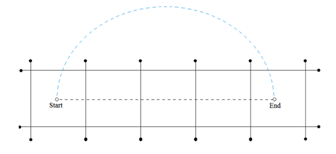

## 문제

Moore’s Law states that the number of transistors on a chip will double every two years. Amazingly, this law has held true for over half a century. Whenever current technology no longer allowed more growth, researchers have come up with new manufacturing technologies to pack circuits even denser. In the near future, this might mean that chips are constructed in three dimensions instead two. But for this problem, two dimensions will be enough.

A problem common to all two-dimensional hardware design (for example chips, graphics cards, motherboards, and so on) is wire placement. Whenever wires are routed on the hardware, it is problematic if they have to cross each other. When a crossing occurs special gadgets have to be used to allow two electrical wires to pass over each other, and this makes manufacturing more expensive.

Our problem is the following: you are given a hardware design with several wires already in place (all of them straight line segments). You are also given the start and end points for a new wire connection to be added. You will have to determine the minimum number of existing wires that have to be crossed in order to connect the start and end points. This connection need not be a straight line. The only requirement is that it cannot cross at a point where two or more wires already meet or intersect.

Figure L.1: First sample input

Figure L.1 shows the first sample input. Eight existing wires form five squares. The start and end points of the new connection are in the leftmost and rightmost squares, respectively. The black dashed line shows that a direct connection would cross four wires, whereas the optimal solution crosses only two wires (the curved blue line).

## 입력

The input consists of a single test case. The first line contains five integers m, x0, y0, x1, y1, which are the number of pre-existing wires (m ≤ 100) and the start and end points that need to be connected. This is followed by m lines, each containing four integers xa, ya, xb, yb describing an existing wire of non-zero length from (xa, ya) to (xb, yb). The absolute value of each input coordinate is less than 105. Each pair of wires has at most one point in common, that is, wires do not overlap. The start and end points for the new wire do not lie on a pre-existing wire.

## 출력

Display the minimum number of wires that have to be crossed to connect the start and end points.
