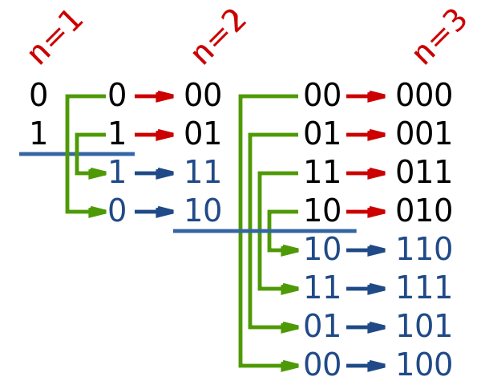

## 문제

As we all know well, the World Cup is currently ongoing. In a few days, the Second Stage of a cup will begin. But the organizers forgot to print the tickets. In order to print the tickets, only one machine is used, and tickets are printed one by one. Using the standard method, the tickets are enumerated from 1 to N, and printed in order. However, since there is not enough time for that, the IT department proposed another solution: print the tickets in an order such that numbers on tickets represent the Gray code, because in that case changing the state of the printer from one ticket to the next one requires only one bit to be changed, and therefore the process of printing the tickets can be hugely improved.

The Gray code is a binary system where consecutive values differ in only one bit. For example, 1001 and 1011 differ in only 1 bit, but 1101 and 1011 differ in 2 bits and hence can’t be consecutive in gray code. One way to construct a gray code from all numbers containing exactly \(n\) bits is the following method:

1. If \(n = 1\), then the gray code is \(\left[ 0, 1\right]\)
2. Else let L1 be the gray code of numbers containing exactly \(n − 1\) bits, \(L\_1 = \left[ s\_1, s\_2, \dots, s\_{2^{n-1}}\right]\), and let \(L\_2\) be the reversed \(L\_1\), that is \(L\_2 = \text{reverse}(L\_1) = \left[ s\_{2^{n-1}}, s\_{2^{n-1}-1}, \dots, s\_2, s\_1 \right]\).  
   Now let \(L'\_1\) be constructed from \(L\_1\) by prefixing each element of \(L\_1\) with 0, and \(L'\_2\) beconstructed from \(L\_2\) by prefixing each element of \(L\_2\) with 1.  
   \(L'\_1 = \left[ 0s\_1, 0s\_2, \dots, 0s\_{2^{n-1}}\right]\)  
   \(L'\_2 = \left[ 1s\_{2^{n-1}}, 1s\_{2^{n-1}-1}, \dots, 1s\_2, 1s\_1 \right]\)  
   Finally, the gray code of all numbers consisting of \(n\) bits, \(L\), is constructed by appending \(L'\_2\) to \(L'\_1\), that is \(L = L'\_1 + L'\_2 = \left[ 0s\_1, 0s\_2, \dots, 0s\_{2^{n-1}}, 1s\_{2^{n-1}}, 1s\_{2^{n-1}-1}, \dots, 1s\_2, 1s\_1 \right]\)

Figure 1 source: [https://en.wikipedia.org/wiki/Gray\_code](./002_Gray_code)

This indeed speeds up the process of printing the tickets by a large factor, but in order to use this method we need a safety method as well. This is needed, because the printer used is not perfect and can sometimes print with a flaw (e.g. can wrongly print some bits in input). However, the printer works correctly in 99% of cases, and therefore only a small number of tickets won’t be printed correctly and those tickets will need to be printed again. For this, we need your help.

Given an number \(n\), the number of bits in numbers, and a number \(K\) that represents the index in the gray code constructed using above method, print the \(K\)th string in this gray code sequence.

## 입력

First and only line of the input contains two integers \(n\) and \(K\), representing the number of bits in numbers and index in gray code sequence, respectively.

## 출력

First and only line of the output should contain a string of \(n\) bits, representing the \(K\)th string in gray code constructed using method described in the problem statement.

## 힌트

Gray code of numbers consisting of 3 bits constructed using the method described in problem statement is: [000, 001, 011, 010, 110, 111, 101, 100], and the 5th in this sequence is 110. Note that the sequence is indexed from 1.
