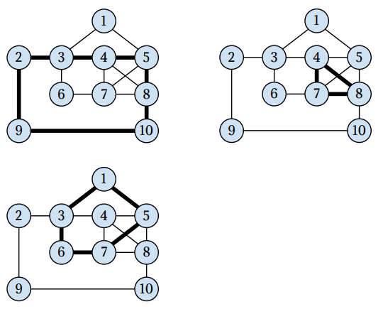

## 문제

It is the year 2036 and Europe is crowded by senior citizens. In order to keep them healthy, the European ministry for majority groups (seniors are a majority!) suggests to have them deliver the small amount of paper mail that is still being sent — typically to seniors. This suggestion is going to be implemented all over Europe.

The ministry has devised a “senior postmen system” in the following way: Europe has been divided into mail districts. A mail district has a street network of streets and junctions. Every street in the network can be walked in both directions. In each district, arbitrarily many senior citizens are available to be hired as mailman. Every morning, each mailman receives a bag with mail to be delivered on a tour that covers a part of the street network. Every tour must be senior–compatible, i.e. it must satisfy the following conditions:

* It starts and ends at the same junction.
* It never passes a junction more than once. (The seniors shall not be confused.)
* It must not have a street in common with any other tour; hence, any street in the district is to be served by exactly one mailman. (The seniors shall not fight with each other.)

Together, the tours must cover the given network: each street in the network must be part of exactly one tour.

The ministry now needs a software that, for a given mail district’s street network, will compute a set of senior–compatible tours that covers the network.

## 입력

The input describes the street network.

The first input line contains two integers N and M. N is the number of junctions, and M is the number of streets. Junctions are numbered from 1 to N.

Each of the following M lines contains two integers u and v (1 ≤ u, v ≤ N, u ≠ v), meaning that there is a street connecting junctions u and v.

For any input holds:

1. Any two junctions can be connected by no more than one street.
2. You can reach any junction from any other by traveling along one or more streets.
3. There is a solution, i.e. a set of senior–compatible tours can be computed that cover the network.

## 출력

Each line of the output should correspond to one senior–compatible tour, and should list the numbers of the junctions in that tour. Junction numbers must be output in the order the junctions are passed by the mailman, with the starting (and ending) junction being output first (and only once).

If more than one solution exists, your program may output any one of them.

## 힌트

The following picture illustrates the street network and the three senior–compatible tours that may be used to cover it.

Note that there are several solutions to this example, among them some with only two tours.
