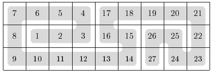

## 문제

A snake fills a 3xn board completely. Successive segments of the snake are numbered from 1 to 3n. The segments with successive numbers (i.e., 1 and 2, 2 and 3, 3 and 4...) occupy squares that share an edge. For example, a snake can fill a 3x9 board as follows:

The snake's segment numbers in some of the squares have been erased. Can you reconstruct the snake?

## 입력

In the first line of the standard input, there is a single integer n (1 ≤ n ≤ 1,000), the length of the board. The three lines that follow describe the board; the i-th of them contains n integers aij (0 ≤ aij ≤ 3n for 1 ≤ j ≤ n). If aij > 0, then aij is the number of the snake's segment occupying the j-th square of the i-th row of the board. If on the other hand aij=0, then the number of the snake's segment on this square is unknown.

## 출력

Your program is to print three lines to the standard output. The i-th lines should hold n positive integers bij(for 1 ≤ j ≤ n). All the numbers bij together should be a permutation of the numbers from 1 to 3n. The output numbers should be a valid reconstruction of the snake, i.e., they should be consistent with the (positive) input numbers and satisfy aforementioned constraints.

You may assume that there is at least one valid reconstruction of the snake. If there is more than one, your program can print any valid reconstruction.
